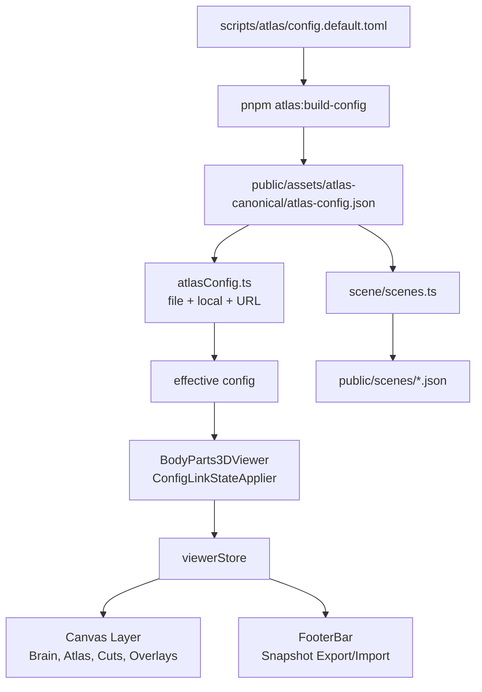

# brain-app Architektur

Stand: 2026-06-19. Diese Datei ist die zentrale Einstiegskarte für neue
Developer und für Produktentscheidungen. Sie beschreibt den aktuellen
Implementierungsvertrag, nicht alte Neuro-Suite-Ideen.

## Zielbild

Die App ist eine React/R3F-3D-Lern- und Vortragsapp für Kapitel 11 der
Kognitiven Neurowissenschaften. Architekturentscheidungen werden gegen drei
Happy Paths geprüft:

1. Dozenten können einen Vortragsschritt öffnen, erklären, speichern und
   wieder laden, ohne Debug-Konsole oder Codewissen.
2. Studenten können einen Lernpfad starten, den Fokus wechseln und den
   sichtbaren Zustand verstehen, ohne die 3D-Werkzeuge kennen zu müssen.
3. Developer können neue Visuals und Animationen anhand von Config, Scene und
   Registry-Pfaden ergänzen, ohne den zentralen Viewer per Reverse Engineering
   zu lesen.

Wenn eine Änderung keinem dieser Pfade hilft, ist sie nicht automatisch Teil
der Produktarchitektur.

## Einstiegspunkte

| Bereich | Pfad | Verantwortung |
| --- | --- | --- |
| App-Boot | `apps/brain-app/src/main.tsx` | Browser-Start, Deep-Link-Routing, App-Mount |
| Shell und Canvas | `apps/brain-app/src/viewer/BodyParts3DViewer.tsx` | Modus-Shell, R3F-Canvas, GLB-Layer, Config-Link-Anwendung |
| Globaler Viewer-State | `apps/brain-app/src/viewer/viewerStore.ts` | Auswahl, Sichtbarkeit, Cuts, Modi, Kamera, Atlas- und Snapshot-State |
| Footer-Cockpit | `apps/brain-app/src/viewer/FooterBar.tsx` | Moduswechsel, Atlas-/Cut-/Farbwerkzeuge, Snapshot-Import/Export |
| Config-Resolver | `apps/brain-app/src/viewer/atlas/atlasConfig.ts` | file/local/URL-Merge, Validierung, effective config |
| Local Config Overrides | `apps/brain-app/src/viewer/atlas/atlasConfigStore.ts` | persistierte UI-Overrides in `localStorage` |
| Unterrichts-Snapshots | `apps/brain-app/src/viewer/viewerStateSnapshot.ts` | versionierter Export/Import des Viewer-Zustands |
| Lernsequenzen | `apps/brain-app/src/scene/scenes.ts` | Laden validierter Scene-JSONs aus der Config-Sequenz |
| Scene-Inhalte | `apps/brain-app/public/scenes/*.json` | Prose, ERP, Flowchart, Image, Table- und Topography-Daten |
| Authoring-Quelle | `scripts/atlas/config.default.toml` | editierbare Presets, Configurations, Presentation/Learning-Sequenzen |
| Build-Gate | `scripts/atlas/build-config.mjs` | TOML nach `atlas-config.json`, Validierung, keine unbekannten Keys |
| BrainModel-Gate | `scripts/atlas/check-brain-model-assets.mjs` | TARO-/MNI-Asset-Budgets, Normalen-Coverage und Face/Normal-Konsistenz |
| Atlas-Geometrie | `scripts/atlas/README.md` | SSoT für MNI/TARO, Runtime-Patches, Carve-Pipeline und Limits |

## Doku-Topologie

Aktuelle Arbeitsdoku ist absichtlich auf wenige zuständige Dateien verteilt.
Neue Agents sollen diese Kette nutzen und historische Protokolle nicht als
aktuellen Vertrag lesen:

1. `PRODUCT.md`: Produktzweck, reguläre Modi und V2-Zielbild.
2. `DESIGN.md`: visuelle Editorial-Schicht und responsive Design-Leitplanken.
3. `CLAUDE.md`: Repo-Einstieg, Atlas-Grenzen, Agent-Regeln und schnelle
   Arbeitsanker.
4. `apps/brain-app/DESIGN.md`: app-lokaler Produkt- und Implementierungsvertrag.
5. `docs/ARCHITECTURE.md`: Runtime-, State-, Config-, Snapshot- und
   Authoring-Vertrag.
6. `scripts/atlas/README.md`: Atlas-, TARO-, fsaverage- und Asset-Pipeline.
7. `docs/VORTRAGS_GRAFIK_AREAL_MATRIX.md`: konkrete Grafik-zu-Areal- und
   Färbungsregeln.
8. `docs/NO_FALLBACK_ARCHITECTURE_INVENTORY.md`: Restklassen für Legacy-,
   Fallback- und Doku-Drift.

Historische Reviews, END_SESSION-Dateien und nicht gemappte Handoff-Mockups
sind Verlaufsevidenz. Sie dürfen Entscheidungen erklären, aber keine aktuelle
Arbeitsanweisung über die obige Kette überschreiben.

## Architekturfluss



## State-Vertrag

Der zentrale UI- und 3D-State liegt in `viewerStore.ts`. Dort gehören nur
serialisierbare, user- oder unterrichtsrelevante Zustände hinein. Three.js-
Objekte, Mesh-Instanzen oder laufende Animationsobjekte gehören nicht in den
Store.

Wichtige State-Gruppen:

1. Modus: `appMode` mit `learn`, `explore`, `phineas`, intern auch `atlas`.
2. Auswahl: `selected`, `selectedSlugs`, `selectedLabels`, `selectMode`.
3. Sichtbarkeit: `hidden`, `isolated`, `isolatedSlugs`, Atlas-/Carve-Toggles.
4. Schnitte: `cuts`, `cutMode`, `clipAtlasOverlay`, `cutSourceRevision`.
5. Visuals: `colorMode`, `activePreset`, `highlight`, ERP-Phase/Puls.
6. Kamera: `cameraView` als one-shot und `cameraPose` für Snapshots.
7. Vortrag: `viewerStateSnapshot.ts` exportiert/importiert reproduzierbare
   Unterrichtszustände.

Default beim Erststart:

1. `appMode` startet aktuell als `explore`.
2. `hidden` startet leer, aber Kontext- und Atlas-Teilbäume werden nach dem
   Laden explizit versteckt.
3. `showSkull`, Atlas-Overlays, Carve-Overlays, Rod und Cuts starten aus.
4. Per-Preset-Default-Sichtbarkeit für normale User-Flows ist noch nicht
   vollständig verdrahtet. Das ist bewusst als Produkt-/Config-Aufgabe offen.

## Config-Vertrag

Die Config ist file-first. Kanonische Authoring-Änderungen passieren in
`scripts/atlas/config.default.toml`, nicht direkt im generierten JSON.

Präzedenz im aktuellen Resolver:

1. Datei-Config aus `atlas-config.json`.
2. Lokale Overrides aus `atlas-config-overrides` in `localStorage`.
3. URL-Parameter.

Wichtige Sonderregel: Wenn die URL `?config=<id>` setzt, ist dieser Link ein
kanonischer Unterrichts-/Review-Link. Lokale Scope-Overrides dürfen ihn nicht
verfälschen. Deshalb ignoriert der Resolver lokale Scopes in diesem Fall.

State-Priorität über Resolver-Grenzen hinweg:

1. Datei-Config ist die reproduzierbare Basis.
2. Lokale Overrides sind nur UI-/Entwicklungs-Overrides und verlieren gegen
   kanonische Links.
3. URL-State gewinnt gegen Datei und lokale Overrides, weil Direktlinks
   reproduzierbare Review- und Unterrichtseinstiege sind.
4. Snapshot-Import gewinnt gegen URL-Config-Defaults, weil der Snapshot den
   konkreten Sitzungszustand eines Dozenten speichert. Nach dem Import darf
   `ConfigLinkStateApplier` Cuts, Highlight, Preset oder Start-Sichtbarkeit
   nicht wieder aus der Config überschreiben.
5. Explizite User-Interaktion nach Import gewinnt ab diesem Moment wieder als
   neuer lokaler Sitzungszustand.

## Lokale Persistenzgrenzen

`localStorage` ist nur für benannte UI-/Session-Zustände erlaubt. Es ist keine
kanonische Autorenquelle, kein versteckter Lernfortschritt und keine
Migrationsbrücke. Korrupte App-eigene Persistenz wirft laut mit Storage-Key im
Fehlertext; sie wird nicht still auf Defaults repariert.

Aktuelle App-eigene Keys:

| Key | Owner | Zweck | Löschpfad |
| --- | --- | --- | --- |
| `atlas-config-overrides` | `atlasConfigStore` | lokale Atlas-/Preset-/Scope-Overrides für UI und Entwicklung; verliert gegen kanonische `?config=`-Links | `clearLocalBrainAppData()` und Root-ErrorBoundary-Reset |
| `brain-app-settings` | `settingsStore` | Anzeige-, Start-, Viewport-, Farb-, Lern-, Sprach-, Atlas-, Presenter- und Rollen-Settings | `clearLocalBrainAppData()` und Root-ErrorBoundary-Reset |
| `brain-app-last-app-mode` | `settingsRuntime` | letzter regulärer Startmodus, nur wenn Settings `start.defaultMode = "last"` erlauben | `clearLocalBrainAppData()` und Root-ErrorBoundary-Reset |
| `brain-app-authoring-snapshot` | `authoringSnapshotStore` | lokaler Authoring-/Timeline-Arbeitsstand für exportierbare Unterrichts-Snapshots | `clearLocalBrainAppData()` und Root-ErrorBoundary-Reset |
| `brain-app-authoring-command-history` | `authoringSnapshotStore` | Undo-/Redo-Verlauf für lokale Authoring-Edits | `clearLocalBrainAppData()` und Root-ErrorBoundary-Reset |
| `ed-theme` | Appearance/Settings UI | DOM-nahe Theme-Auswahl für sofortige Darstellung | `clearLocalBrainAppData()` und Root-ErrorBoundary-Reset |

Die zentrale Runtime-Liste steht in
`apps/brain-app/src/localAppStorageKeys.ts`. Neue App-eigene lokale Keys müssen
dort, im Clear-Flow und in dieser Architekturkarte ergänzt werden. Fremde Keys
werden nicht gelöscht.

Config-Bausteine:

1. `presets.*`: Default-Scope- und Start-Sichtbarkeits-Sets wie `kapitel11`,
   `explorer`, `voll`.
2. `mesh_mappings.*`: kanonische Bucket- und Scene-Region-Auflösung zu Meshes.
3. `configurations.*`: fachliche Atome für Folie, Lernschritt oder
   Abbildungsersatz.
4. `presentation.*`: geordnete Vortragsschritte.
5. `learning.*`: geordnete Lernpfade.

Unbekannte Presets, Configurations, Areas oder invalides JSON sollen laut
fehlschlagen. Stille Reparaturpfade sind nicht Teil der Architektur.
Legacy-/Fallback-/Deprecated-Reststellen werden zentral in
[`docs/NO_FALLBACK_ARCHITECTURE_INVENTORY.md`](NO_FALLBACK_ARCHITECTURE_INVENTORY.md)
geführt. Diese Inventur gewinnt gegen ältere Notizen, solange die jeweilige
Restklasse nicht umgesetzt und verifiziert ist.

`visibility.hidden` und `visibility.isolated` dürfen auf Preset- und
Configuration-Ebene stehen. `atlasConfig.ts` mergt Preset-Defaults mit der
aktiven Configuration; Configuration-Felder überschreiben Preset-Felder.
`ConfigLinkStateApplier` wendet diese Start-Sichtbarkeit nur für explizite
`?preset=...`- oder `?config=...`-Links an. Er merkt sich dabei ausschließlich
die zuletzt gesetzten Config-Defaults, damit ein Preset-/Config-Wechsel alte
Defaults entfernt, aber manuell versteckte Strukturen nicht als Config-State
behandelt.

## Snapshot-Vertrag

Dozenten-Zustände werden über `viewerStateSnapshot.ts` versioniert. Version
`1` enthält unter anderem:

1. Modus, Sprache, Auswahlmodus.
2. Kamera-Pose und named camera view.
3. aktive Schnitte, Cut-Modus und Atlas-Clipping.
4. versteckte und isolierte Strukturen.
5. Highlight, Farbe, aktives Preset.
6. Atlas-/Carve-Toggles, Skull/Rod-Zustand und Pick-State.

Import setzt den Store bewusst neu und rekonstruiert Auswahl, Isolation und
Kamera über die Store-Methoden. Ungültige Snapshot-Felder werfen Fehler. Ein
Snapshot ersetzt keinen kanonischen Config-Step: Config definiert das
unterrichtbare Atom, Snapshot speichert den konkreten Zustand einer Sitzung.
Deshalb setzt `viewerStateSnapshot.ts` beim Import einen kurzlebigen
Route-Guard: Solange die importierte Snapshot-Route aktiv ist, überspringt
`ConfigLinkStateApplier` seine Config-Default-Anwendung für Cuts, Highlight,
Preset und Start-Sichtbarkeit.

## Modi und Bedienflächen

Die Shell ist ein 3D-Produkt, keine Landingpage. `BodyParts3DViewer.tsx` wählt
Sidebar und Viewport-Zuschnitt nach `appMode`.

| Modus | Zweck | Sidebar |
| --- | --- | --- |
| `learn` | geführte Szenen, Vortrag und Selbstlernen | `LearnSidebar` |
| `explore` | freie Struktur- und Atlas-Erkundung | `StructureTree` |
| `phineas` | Fallstudie Phineas Gage | `PhineasSidebar` |
| `atlas` | interner kanonischer fsaverage-Atlasmodus | `CanonicalAtlasMode` |

`FooterBar.tsx` ist das globale Cockpit. Es bündelt Moduswechsel, Atlas,
Farbe, Schnitt, Ansicht, Kontext und Snapshot. Neue globale Werkzeuge gehören
hier nur hin, wenn sie den Dozenten- oder Studentenfluss vereinfachen.

## BrainModel-Vertrag

`BodyParts3DViewer.tsx` lädt das sichtbare Hirn nicht mehr als implizit
festen Pfad, sondern über `src/viewer/brainModelOptions.ts`. Der Default bleibt
`taro` mit `public/assets/bodyparts3d/brain.glb`; zusätzliche MNI-Review-
Modelle liegen unter `public/assets/brain-models/mni152/` und werden per
`?brainModel=<id>` oder über den Review-Selector im 3D-Viewport gewählt.

Aktuelle registrierte Optionen:

1. `taro`: Produktionsdefault.
2. `mni-mobile-r05`: kleinste MNI-Mobile-Review-Variante.
3. `mni-mobile-r06`: balancierte MNI-Mobile-Review-Variante.
4. `mni-mobile-r08`: ehemalige Mobile-Balanced-Referenz aus dem Monorepo.
5. `mni-desktop-r18`: Desktop-Referenz für Detailvergleich.

Release-Regel: Kein BrainModel darf ohne explizite Normalen und Budget-Gate in
die App. `pnpm verify:brain-models` prüft dafür:

1. Datei existiert und bleibt innerhalb des Größenbudgets.
2. erwartete Meshzahl bleibt stabil.
3. jedes Primitive besitzt `NORMAL`.
4. Normalenlängen sind plausibel.
5. Face/Normal-Abweichung bleibt unter dem modellbezogenen Grenzwert.

Der MNI-Pfad ist aktuell ein Geometrie- und Performance-Review-Pfad. Er ersetzt
TARO nicht als semantischen Produktionsdefault. TARO-spezifische
Auswahl-Slugs, Carves und kuratierte Unterrichtslinks bleiben nur für TARO als
vollständig produktiv belegt, bis eine eigene MNI-Registry mit Pick-,
Overlay- und Atlas-Mapping-Gates vorliegt.

### Responsive Shell-Vertrag

`apps/brain-app/src/viewer/explorerShellLayout.ts` benennt den
Responsive-Vertrag der Shell. Dieser Vertrag ist die Grenze für V2-Shell-
Arbeit; einzelne Komponenten dürfen `isNarrow` nicht abweichend als eigenen
Shell-Modus interpretieren.

1. `desktop-split`: breite Maus-/Desktop-Viewports. 3D-Bühne und rechte
   Sidebar/Rail stehen nebeneinander.
2. `portrait-drawer`: Phone- und Tablet-Portrait. Der Explorer-Strukturbaum
   öffnet als Drawer; Lern- und Fallstudieninhalte liegen unter der 3D-Bühne.
3. `landscape-rail`: grobe Touch-Landscape-Viewports bis 1100 px. Die Shell
   bleibt im horizontalen Split und nutzt eine rechte Rail statt des
   Portrait-Drawers.

Lokale Browser-Evidence läuft über:

```bash
cd apps/brain-app
pnpm dev -- --host 127.0.0.1 --port 5173
SMOKE_URL=http://127.0.0.1:5173 pnpm smoke:responsive-layout
```

Dieser Smoke ist bewusst lokal. GitHub Actions dürfen daraus keinen
Playwright-/E2E-Schritt ableiten.

### Studentischer Fortschritt

Studentisches Lernen nutzt denselben `learn`-Modus und denselben
`learning.kapitel11-pfad` wie der Vortragspfad. Der erste Vertrag liegt
in `src/viewer/studentProgress.ts`:

1. `StudentProgressState` ist versioniert, `learning`-only und referenziert
   bestehende `configName`-/`sceneId`-Steps.
2. Status bleibt klein: `not-started`, `seen`, `checked`.
3. Lernchecks speichern `checkId`, Ergebnis, Versuchszahl und Zeitstempel.
4. Persistenz läuft über `ViewerStateSnapshot.state.studentProgress`.

Entscheidung: kein stilles `localStorage` für Lernfortschritt und kein
Cloud-Sync in diesem Slice. Snapshots sind der kanonische erste
Persistenzpfad, bis ein echtes Nutzer-/Kursmodell existiert.

## Visual-Authoring

Neue Visuals sollen aus Config- und Scene-Daten entstehen. Der Standardweg:

1. Fachliches Atom in `scripts/atlas/config.default.toml` unter
   `configurations.<id>` anlegen.
2. `regions`, `camera`, `visibility`, `colors`, `cuts`, `overlay` und
   `sequencing` dort explizit setzen.
3. Falls ein Overlay eine Scene braucht, `overlay.scene = "<scene-id>"` setzen.
4. Scene-Datei `apps/brain-app/public/scenes/<scene-id>.json` anlegen oder
   erweitern.
5. Step in `learning.<name>.steps` oder `presentation.<name>.steps` aufnehmen.
6. `pnpm atlas:build-config` ausführen und die generierte Config nicht manuell
   editieren.
7. Mit Direktlink prüfen, zum Beispiel `?config=vcpt` oder bestehende
   Scene-Links.

Wenn nur Text, ERP, Flowchart, Image oder Prose gebraucht wird, soll kein
Viewer-Code geändert werden. Viewer-Code ist erst nötig, wenn ein neuer
Overlay-Typ, eine neue 3D-Layer-Klasse oder eine neue Interaktion eingeführt
wird.

`src/scene/scenes.ts` lädt `learning`- und `presentation`-Sequenzen
first-class. Der Sequenzkontext läuft über `?sequence=<kind>.<name>` und wird
in Unterrichts-Snapshots mitpersistiert; `build-config` verlangt deshalb für
alle Sequence-Steps ein `overlay.scene`.

Konkretes Beispiel VCPT:

1. Config-Atom:
   `scripts/atlas/config.default.toml` -> `[configurations.vcpt]`.
2. Scene-Daten:
   `apps/brain-app/public/scenes/vcpt.json`.
3. Overlay-Verknüpfung:
   `[configurations.vcpt.overlay]` setzt `kind = "flowchart"` und
   `scene = "vcpt"`.
4. Lernsequenz:
   `[learning.kapitel11-pfad].steps` enthält `"vcpt"`.
5. Runtime-Lader:
   `apps/brain-app/src/scene/scenes.ts` lädt die Sequenz, validiert
   `vcpt.json` gegen `SceneSchema` und hängt `configName = "vcpt"` an.
6. Viewer-Anwendung:
   `ConfigLinkStateApplier` in `BodyParts3DViewer.tsx` setzt Cuts,
   Carve-Overlay, Highlight und optional Preset aus der effective config.
7. Prüfung:
   `pnpm atlas:build-config`, `pnpm test`, dann Browser-Direktlink
   `/?config=vcpt`.

## AuthoringScene-Vertrag

`apps/brain-app/src/viewer/authoringScene.ts` ist der kanonische
Persistenzvertrag für importierte oder positionierbare Objektinstanzen. Der
Vertrag erweitert Config und Scene, ersetzt sie aber nicht: fachliche
Vortrags- oder Lernschritte bleiben in `configurations`, `learning` und
`presentation`; `AuthoringScene` beschreibt stabile Objektinstanzen mit
Asset-/Collection-ID, Parent-Bezug, Sichtbarkeit, serialisierbarem TRS,
Origin-Policy, selectable Parts (`partId`, Label, optional `nodeName`,
`pickable`, `role`), Helper-Nodes (`role = "helper"`, `pickable = false`),
optionalen Clip-Bindings und Annotations.

Der Vertrag ist versioniert (`schemaVersion`) und wird beim Parsen laut
validiert. Ungültige Versionen, fehlende IDs, unbekannte Felder, ungültige
Vektoren oder nicht-finite Zahlen sind Fehler, keine stillen Defaults. Rotation
ist aktuell als Euler-TRS `[x,y,z]` modelliert, weil dieser Slice nur
serialisierbares Authoring und Roundtrip validiert; Quaternionen,
Interpolationsregeln und Clip-Laufzeitlogik gehören in spätere versionierte
Slices.

State-Priorität bleibt dieselbe wie bei Config und Snapshot:

1. Datei-Config definiert die reproduzierbare Basis.
2. URL-State definiert kanonische Review- und Unterrichtseinstiege.
3. Snapshot-Import gewinnt gegen URL-/Config-Defaults, wenn er konkreten
   Sitzungszustand wiederherstellt.
4. Explizite User-Interaktion gewinnt danach als neuer lokaler Zustand.

`apps/brain-app/src/viewer/authoringSnapshotStore.ts` übernimmt diese
Reihenfolge für authored Objekt- und Timeline-State. `ViewerStateSnapshot`
exportiert/importiert `AuthoringSnapshotState` mit Registry-Kontext,
`AuthoringScene`-Dokumenten, Timeline-Dokumenten, aktivem Target,
Timeline-Cursor und Animation-State. Fehlende aktive Scenes, Keyframes,
Objekt- oder Part-IDs werden beim Import laut abgelehnt; ein Browser-Smoke
importiert und exportiert einen minimalen EEG-Device-Snapshot über die
Footer-Datei-UI.

Nach einem Snapshot-Import darf `ConfigLinkStateApplier` keine importierten
AuthoringScene-Felder direkt wieder mit Config-Defaults überschreiben.

`apps/brain-app/src/viewer/authoringCommands.ts` und
`apps/brain-app/src/viewer/authoringCommandHistory.ts` bilden den kleinen
Command-/History-Kern für authored Objekt-Edits. Commands sind reine Daten:
`set-transform` trägt `targetRef`, `before` und `after`, `batch` gruppiert
mehrere `set-transform`-Commands für spätere Mehrfachauswahl. Execute, Undo,
Redo, History-Cursor und JSON-Roundtrip laufen über reine Helper und schreiben
immer zurück in `AuthoringScene`; Gizmos oder Drag-Handler dürfen dadurch
keinen dauerhaften Neben-State neben `AuthoringScene` halten. Drag-Streams
werden am Ende explizit über `coalesceSetTransformTransaction(...)` zu einem
Command verdichtet.

Nicht Teil dieses Vertrags: GLB/GLTF-Loader, Picking im Runtime-Viewer,
TransformControls oder ein Browser-Editor-Roundtrip. Diese Slices bauen später
auf dem Vertrag auf, ohne eine zweite Objekt-, Loader- oder
Timeline-Architektur einzuführen.

## Asset-Manifest-Vertrag

`apps/brain-app/src/viewer/assetManifest.ts` beschreibt den versionierten
Vertrag zwischen Knowledge-Registry, AuthoringScene und späterem GLB/GLTF-
Loader. Das Manifest besitzt die Asset-Ebene: `assetId`, `collectionId`,
`slotId`, URI, Format (`glb` oder `gltf`), optionale Slot-Markierung,
SemVer-Version, SHA-256-Hash, Provenienz, Lizenz, Vorschau, Normalisierung,
Materialpolitik, Node-Naming-Regeln und stabile Parts.

Die generische Runtime lädt daraus noch keine beliebigen Modelle. Der
Phineas-Modus nutzt seine manifestierten Slots bereits spezifisch für
Vollschädel, Calvarium-Cut und Eisenstange und koppelt die sichtbaren GLB-Meshes
an `SequenceTargetRef`-/ObjectGraph-IDs. Der Parser validiert den lieferbaren
Pipeline-Stand laut: URI muss unter `/assets/` liegen und zur Format-Endung
passen, Hashes sind `sha256:<64 hex>`, Scale und `rootTransform` sind finite
TRS-Werte, Parts sind kebab-case IDs mit stabilen GLB-Node-Namen, und
Helper-Parts bleiben `pickable = false`. Bestehende BodyParts3D-/Context-GLBs
sind bereits für die Runtime rezentriert und nach Y-up gedreht; ihr Manifest
nutzt deshalb `scale = 1` statt einer pauschalen Meter-Konvertierung. Optionale
Knowledge-Slots dürfen sichtbar fehlen (`missing-optional`); required Slots
werden als `missing-required` zurückgegeben und nicht still ersetzt.

Für Phineas ist dieser Pfad mit echten Runtime-Dateien belegt:
`asset-manifest.json` erfüllt die Slots von `case-phineas-gage`, und
`authoringAssetLoader.test.ts` legt Vollschädel, Calvarium-Cut und Eisenstange
aus dem Manifest als `AuthoringScene` an, speichert sie im
`AuthoringSnapshotState` und validiert den Roundtrip gegen
`validateBrainAppContracts(...)`. Standalone-Persistenz ist damit die
versionierte Manifest-/Snapshot-Datei; eine spätere DB-Persistenz muss diesen
Contract übernehmen.

Damit bleiben Verantwortlichkeiten getrennt:

1. `KnowledgeRegistry` sagt, welche Collection welchen Asset-Slot hat.
2. `AssetManifest` sagt, welches GLB/GLTF diesen Slot aktuell erfüllt.
3. `AuthoringScene` instanziiert Assets mit TRS, Parent-Bezug und Parts.
4. `SequenceTargetRef` adressiert Instanzen und Parts unabhängig vom Loader.
5. Ein späterer generischer Loader darf fehlende required Assets laut
   abbrechen, aber keine Fallback-Geometrie erfinden.

## Registry-Launch-Vertrag

`apps/brain-app/src/viewer/registryLaunch.ts` ist der generische
Startvertrag für Registry-Collections und Bonus-Kontexte. Ein Launch besteht
aus `collectionId`, `contextId` und einem `entrypoint`; Phineas nutzt damit
`case-phineas-gage` + `phineas-gage` + `entrypoint = mode:phineas`, ohne dass
Explorer-Flyout oder Snapshot-Import den Fallnamen selbst verzweigen müssen.

EntryPoints sind reine Daten:

1. `app-mode` für bestehende App-Modi wie `phineas`.
2. `scene` und `config` für bestehende `SceneLocation`-/Config-Routen.
3. `animation`, `snapshot` und `timeline` als reservierte, validierte
   Erweiterungspunkte für spätere Consumers.

Die URL trägt den Launch als `collectionId`, `contextId` und `entrypoint`.
Für aktuelle Runtime-Consumer werden zusätzlich die bestehenden Router-
Parameter mitgeführt: `mode` bei AppMode-Launches, `config`/`scene`/`step` bei
Scene- oder Config-Launches. `ViewerStateSnapshot` persistiert `launch`
separat von `route`; Snapshot-Import stellt die Launch-URL wieder her und
leitet den `appMode` aus dem EntryPoint ab, wenn kein expliziter `appMode` im
Snapshot steht.

Unbekannte Collections, unbekannte Kontexte oder Kontexte, die nicht zur
Collection gehören, werden laut abgelehnt. Für Kontexte mit
`animationHints.sceneId` kann der EntryPoint aus den Bonus-Kontext-Daten
abgeleitet werden; ansonsten muss der EntryPoint explizit deklariert sein.

## Versionierung und Contract-Validation

`apps/brain-app/src/viewer/contractValidation.ts` ist der kleine reine
Prüf-Layer über den einzelnen Dokumentverträgen. Die Einzelparser bleiben für
Form und interne Referenzen zuständig; der Contract-Validator bündelt nur
Cross-Refs zwischen Registry, Bonus-Kontexten, Asset-Manifest,
AuthoringScene, Timeline und Snapshots. Er hat keine `fetch`-, `window`- oder
Zustand-Abhängigkeit und gibt eine Fehlerliste zurück; der harte Wrapper
`assertBrainAppContracts(...)` wirft erst danach.

Aktuelle Versionen:

1. `KnowledgeRegistry` und `BonusContexts`: statische v1-Registry-Konstante.
2. `AssetManifest`, `AuthoringScene`, `TimelineDocument`: `schemaVersion = 1`,
   unbekannte Versionen werden laut abgelehnt.
3. `AuthoringCommand` und `AuthoringCommandHistory`: `schemaVersion = 1`,
   weil History-Einträge serialisierbare Daten bleiben und keine Methoden
   speichern.
4. `RegistryLaunch`: `schemaVersion = 1`, weil Launches als
   `collectionId/contextId/entrypoint` versionierte Snapshot- und URL-Daten
   sind.
5. `ViewerStateSnapshot`: `version = 1`, weil der bestehende Export dieses
   Feld bereits nutzt. Runtime-Import darf weiterhin gegen den aktuellen
   Sitzungszustand fallbacken; Contract-Validation nutzt einen expliziten
   Fallback und mutiert keinen Store.

Migrationen werden nicht geraten. Für Verträge ohne ältere kanonische Version
gilt: unknown/future Versionen rejecten. Erst wenn ein echter gespeicherter
Consumer eine alte Form braucht, bekommt dieser Pfad einen gezielten Migrator
mit Fixture.

## SequenceTargetRef + Object-Graph-Vertrag

`apps/brain-app/src/viewer/sequenceTargetRef.ts` ist der gemeinsame
Adressvertrag für Ziele, die später von Sequenzen, Animationen, Picking oder
Mehrfachauswahl referenziert werden. Der Vertrag behandelt bestehende
Strukturziele und importierte Assets gleich: `ontology-node`, `atlas-role`,
`eeg-site`, `asset-instance` und `asset-part` bekommen jeweils eine
deterministische `target:*`-Object-Graph-ID.

Kanonische Beispiele:

1. `target:ontology-node:taro:<ontologyNodeId>` für TARO-/Strukturbaum-Ziele.
2. `target:atlas-role:<collectionId>:<atlasRole>` für kuratierte Atlasrollen
   wie ACC, OFC oder VMPFC.
3. `target:eeg-site:device-eeg-10-20:<site>` für EEG-10-20-Sites.
4. `target:asset-instance:<collectionId>:<instanceId>` für importierte
   AuthoringScene-Objekte.
5. `target:asset-part:<collectionId>:<instanceId>:<partId>` für einzelne
   Parts; Helper-Parts bleiben adressierbar, aber nicht pickbar und nicht im
   Outliner sichtbar.

Parsing ist strikt: falsche `targetKind`-Werte, fehlende Pflichtfelder,
unbekannte Felder oder ungültige EEG-Sites werfen laut. Auflösung ist bewusst
zweiphasig: `parseSequenceTargetRef(...)` validiert die Form, während
`resolveSequenceTargetRef(...)` unbekannte Laufzeitziele als `status:
"unknown"` mit stabiler Object-Graph-ID und Grund zurückgibt. Dadurch können
UI und Sequenzruntime fehlende Targets sichtbar und harmlos behandeln, ohne
stille Fallbacks einzubauen.

Der Object-Graph aus `AuthoringScene` erzeugt Import-Root-Knoten für
Asset-Instanzen und Part-Knoten für `parts`. Parent-Bezüge folgen
`parentId`, Helper-Parts bleiben `pickable = false` und sind nicht im
Outliner sichtbar. Das ist nur der Adress- und Graph-Vertrag; Runtime-Picking,
Multiselect, TransformControls, Loader und Timeline-Keyframes bleiben separate
Slices. Commands nutzen aktuell `asset-instance`-TargetRefs aus diesem Vertrag
für Transform-Edits.

## Timeline-/Keyframe-Vertrag

`apps/brain-app/src/viewer/timelineDocument.ts` ist der erste reine
Datenvertrag für didaktische Zeitabläufe. Er ersetzt weder Config-Sequenzen
noch `AuthoringScene`: `learning`, `presentation` und spätere Case-/Device-
Einstiege liefern weiterhin den fachlichen Einstieg, während das
Timeline-Dokument Kamera, Overlay/Text, Labels, Annotations, Kontexte,
Collections, Objektzustände und Clip-/Animation-State an stabile Steps und
Keyframes bindet.

Der Vertrag ist versioniert (`schemaVersion`) und validiert strikt:
unbekannte Felder, leere IDs, nicht-finite Zeiten, doppelte Step-/Keyframe-
IDs, Keyframes außerhalb der Step-Dauer, ungültige `SequenceTargetRef`s und
ungültige Restore-Ziele werfen laut. Optionale Channels werden nicht durch
stille Defaults ersetzt; ein leerer Channel bleibt im JSON nur dann leer, wenn
er bewusst als `{}` gespeichert wurde.

Kanonische Root-Felder:

1. `timelineId` identifiziert das authored Timeline-Dokument.
2. `restore.stepId` und `restore.keyframeId` beschreiben den aktuellen
   authored Stand für Snapshot-/Route-Restore.
3. `restore.route` kann `configName`, `sceneId` und `step` tragen, damit ein
   Snapshot zuerst in den richtigen Unterrichtseinstieg zurückfindet.
4. `steps[]` tragen stabile `stepId`, explizite `order`, `durationMs` und
   geordnete `keyframes[]`.
5. `keyframes[]` tragen `keyframeId`, `atMs`, optional `holdMs` und
   `channels`.

Channel-Grenzen:

1. `camera` speichert benannte Views und optional eine konkrete Pose
   (`position`, `target`, `fov`).
2. `overlay` speichert Scene-/Config-Bezug und Textdaten, ohne die
   Scene-Datei zu duplizieren.
3. `labels` und `annotations` referenzieren ausschließlich
   `SequenceTargetRef`.
4. `contexts` und `collections` aktivieren Registry-Kontexte und Layer
   deklarativ.
5. `objects` referenziert `SequenceTargetRef` und übernimmt für Transforms die
   `AuthoringTransform`-Form aus `AuthoringScene`.
6. `animation` modelliert Clip-Bindings und Player-Aktionen (`play`, `pause`,
   `stop`, `scrub`) als authored Zustand, nicht als laufenden Timer.

Adapterplan:

1. `learning`: bestehende Config-Sequenzen bleiben die ladbare Reihenfolge.
   Ein Timeline-Step darf an `configName`, `sceneId`, `step` und
   `SequenceTargetRef` andocken, aber `loadScenes(...)` nicht durch eine
   zweite Sequenzquelle ersetzen.
2. `presentation`: Präsentationspfade dürfen Timeline-Keyframes erst
   konsumieren, wenn ihre Sequence-Quelle explizit ladbar ist. Bis dahin ist
   der Vertrag nur Adapterziel.
3. Phineas: der Fallstudienmodus bleibt eigener Consumer. Timeline-Events
   dürfen Phineas nicht implizit aus `learning` oder `presentation`
   mutieren.
4. `AnimationPlayer.tsx`: konsumiert registrierte Timeline-Dokumente. Neue
   Produktivanimationen werden als Timeline-Vertrag registriert, nicht als
   zusätzlicher Viewer-Hardcode.
5. Snapshot/Route-Restore: Snapshot-Import gewinnt gegen Config-Defaults und
   muss `restore.stepId`/`restore.keyframeId` plus Route anwenden, bevor neue
   User-Interaktion wieder lokalen Zustand schreibt. Fehlende Steps oder
   Targets werden sichtbar behandelt oder laut abgelehnt, nicht still
   verworfen.

Nicht Teil dieses Vertrags: Timeline-Editor-UI, Loader, Picking,
TransformControls und Browser-Editor-Smoke. Diese Arbeiten bleiben Folge-
Slices auf Basis des bestehenden Timeline-Datenvertrags.

## Animation-Authoring

Aktueller Stand:

1. `apps/brain-app/src/viewer/animations.ts` enthält die registrierte
   `BASAL_GANGLIA_TIMELINE` als aktuelles `TimelineDocument`.
2. `apps/brain-app/src/viewer/AnimationPlayer.tsx` liest diese Timeline direkt
   und spiegelt den aktiven Step über `setHighlight(...)` in den Viewer-Store.
3. ERP-nahe Animationen laufen separat über `erpAnimation.ts` und den
   Store-Zustand `erpActive`, `erpPhase`, `erpPulse`.

Zielvertrag für neue Presentation-Animationen:

1. Neue Animationen bekommen eine stabile ID und werden über Config/Scene
   referenziert.
2. Der Player darf nicht pro Animation Spezialfälle in der Viewer-Shell
   erzeugen.
3. Play, Pause, Step, Scrub und Snapshot-Relevanz werden explizit modelliert.
4. R3F-Animationen schreiben nicht in jedem Frame React-State. Hochfrequente
   Bewegung läuft über refs, delta-time und isolierte Komponenten.
5. Sichtbarkeit wird bevorzugt über `visible`/Materialzustand gesteuert, nicht
   durch permanentes Remounting großer GLB-Teilbäume.

Die bestehende Timeline-Registry ist bewusst klein: Sie führt aktuell die
Basalganglien-Schleife und liefert die registrierten Highlight-Bindings für die
Contract-Validierung. Für mehrere produktive Vortraganimationen wird diese
Registry erweitert, bevor neue Player-Spezialfälle entstehen.

Konkretes aktuelles Beispiel Basalganglien-Schleife:

1. Daten:
   `apps/brain-app/src/viewer/animations.ts` definiert
   `BASAL_GANGLIA_TIMELINE` mit stabiler `timelineId`, Quelle, geordneten
   Steps und expliziten `SequenceTargetRef`-Targets.
2. Player:
   `apps/brain-app/src/viewer/AnimationPlayer.tsx` liest diese Timeline und
   spiegelt den aktiven Step über `setHighlight(...)` in den Viewer-Store.
3. Grenze:
   Neue produktive Animationen sollen die Timeline-Registry erweitern und
   später über Config/Scene-ID auswählbar werden.
4. Prüfung:
   Player-Interaktionen müssen mindestens Play, Pause, vorheriger/nächster Step
   und Highlight-Rücksetzung beim Schließen abdecken.

## Dozenten-Happy-Path

Ziel: maximal wenig Reibung im Vortrag.

1. Vortrag öffnen: per URL oder Startscreen in den passenden Modus.
2. Step wechseln: über ladbare Presentation-Sequenz, nicht über manuelle
   Debug-Links.
3. Visual erklären: Fokus, Kamera, Farben, Schnitte und Overlay sind im Step
   vorkonfiguriert.
4. Zustand speichern: Footer `Zustand -> Exportieren`.
5. Zustand laden: Footer `Zustand -> Importieren`.
6. Abweichungen zeigen: Dozent darf manuell schneiden, isolieren, Atlas wechseln
   und den Zustand danach als Snapshot sichern.

No-go: Vortragsschritte dürfen nicht davon abhängen, dass jemand die DevTools
nutzt, JSON im Browser editiert oder verdeckte lokale Overrides kennt.

## Studenten-Happy-Path

Ziel: verstehen statt Werkzeug lernen.

1. Lernpfad starten.
2. Scene erklärt genau eine fachliche Idee.
3. 3D-Fokus, Text, Overlay und Kamera zeigen dieselbe Idee.
4. Nicht-fokussierte Objekte bleiben sichtbar genug für Orientierung, aber
   deutlich gedimmt.
5. Rücksprung, Wiederholung und nächster Schritt sind sichtbar.

Der Studentenmodus darf später mehr Übungslogik bekommen. Das muss aber auf
diesem Grundsatz aufbauen: klare Defaults, sichtbarer Zustand, keine
Werkzeugüberforderung.

## Developer-Happy-Path

Neues Visual für eine Folie:

1. Folie und fachliche Aussage klären.
2. Passende `configuration` in `config.default.toml` ergänzen.
3. Mesh-Zuordnung über `mesh_mappings` oder `scene_regions` nutzen.
4. Scene-JSON unter `public/scenes` anlegen.
5. Sequence-Step eintragen.
6. Config bauen.
7. Direktlink und Browser-Smoke prüfen.
8. Falls die Darstellung schematisch ist, in UI oder Doku kennzeichnen.

Neue Animation für eine Folie:

1. Erst prüfen, ob die Animation als Scene/Overlay reicht.
2. Wenn echte 3D-Zeitlogik gebraucht wird, Animation-Registry nutzen oder
   vorher bauen.
3. Animation über ID in Config/Scene referenzieren.
4. Player-Funktionen Play/Pause/Step/Scrub testen.
5. Snapshot-Relevanz explizit entscheiden.

## Offene Architekturpunkte

Diese Punkte sind bewusst nicht als erledigt dokumentiert:

1. Animationen brauchen eine config-getriebene Registry statt eines
   hardcodierten Einzelplayers.
2. Visual-Abnahme braucht Browser-Smokes für Dozenten-, Studenten- und
   Developer-Happy-Path.
3. Der UV-freie Tissue-Detailpfad ist nur als Entscheidung dokumentiert. Eine
   Umsetzung braucht eigene Desktop-/Phone-Screenshots und Runtime-Evidenz,
   bevor sie als realistischer Materialpfad gilt.

## Verifikation

Dokumentationsänderungen brauchen mindestens:

```bash
pnpm atlas:build-config
pnpm test
```

Bei Runtime-, Render- oder Routing-Änderungen zusätzlich:

```bash
pnpm typecheck
pnpm build
pnpm test:e2e
```

Bei 3D-/Canvas-Änderungen ist ein Browser-Smoke Pflicht: Desktop/Beamer,
Tablet und Phone, dazu mindestens ein Atlas-/Cut-Pfad und ein Lernpfad.
