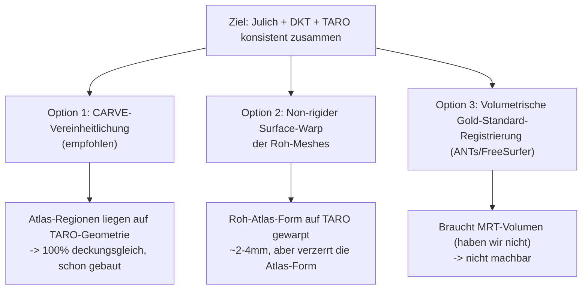

# Atlas-Registrierung — sauberer Plan (Julich + DKT + TARO zusammenbringen)

> **Stand:** 2026-06-13. Geschrieben nach mehreren Affine-Iterationen, die alle dieselbe Wand
> getroffen haben. Dieses Dokument benennt die **Wurzel** des Problems ehrlich und legt **drei
> saubere Optionen** mit klarer Empfehlung vor — statt weiter an Affinen zu schrauben.

## 0. Tilt-Befund (2026-06-13, gemessen) — warum die Brains „verdreht" wirken

Die drei Meshes liegen in **drei verschiedenen Orientierungen** (gemessen über die AP-Achse
Occipital→Frontalpol):

| Mesh | AP-Achse | Orientierung |
| :-- | :-- | :-- |
| **TARO** | [0.08, **0.22**, 0.97] | **~13.5° nach oben gekippt** (BodyParts3D ist nicht AC-PC-level) |
| **RAW Julich** | [−0.03, −0.03, **−0.999**] | achsen-aligned, **anterior = −Z (Z-geflippt vs TARO)** |
| **RAW DKT** | [0.14, **0.18**, **−0.97**] | Z-geflippt UND ~10° gekippt — **anders als Julich** |

→ Bestätigt: Julich und DKT unterscheiden sich fundamental (verschiedene Frames), und TARO ist
selbst gekippt. Jede Quelle braucht ihre eigene Orientierungs-Korrektur. Eine allgemeine
Least-Squares-Affine tauscht Rotation gegen Scherung und liess **~5° Rest-Tilt**. Fix: **Procrustes/
Umeyama-Basis** (SVD, reine Rotation+Skalierung, kein Flip) + **korrespondenz-getriebener RBF-Warp**
auf die Carve-Ziele → **~3° Rest-Tilt (PCA), ~5 mm Platzierung** (`warp_overlay.py`).

**Decke:** ~3° / ~5 mm ist nah am Boden für ein Roh-Overlay. Tighter warpen heisst, die Roh-Geometrie
exakt auf die Carve-Ziele zu ziehen → sie **wird** zum Carve (Original-Form verloren). Das bestätigt
Option 1 als sauberste Lösung.

## 1. Das eigentliche Problem (Wurzel, nicht Symptom)

Wir haben **drei Meshes aus drei verschiedenen Räumen**:

| Mesh | Quelle | Raum / Frame | Was es ist |
| :-- | :-- | :-- | :-- |
| **TARO** (`brain.glb`) | BodyParts3D | TARO-Individuum | das Ziel-Hirn (die Bühne) |
| **Julich-292** (`julich3.glb`) | EBRAINS Julich-Brain | MNI152-ICBM-2009c-Asym | zytoarchitektonischer Atlas |
| **DKT/Brodmann/CIT168** (`mni152-learn-brain.glb`) | learn-brain | **anderer** MNI/learn-Frame | gyraler Atlas + Kerne |

**Drei harte Fakten, die jede Affine-Lösung sprengen:**

1. **TARO ist ein anderes Gehirn** als MNI152 (Einzelindividuum vs. Populationsmittel). Verschiedene
   Gehirne haben **verschiedene Furchen-/Windungsmuster**. Es gibt **keine** lineare (Affine-)Abbildung,
   die zwei verschiedene Gehirne zur Deckung bringt — bestenfalls ~10 mm Restfehler (gemessen, bestätigt).
2. **Julich und DKT liegen in VERSCHIEDENEN Frames** (`scripts/atlas/README.md` §0.4: julich3 ≠
   mni-learn-Frame, ~21 mm auseinander). Sie stimmen also **nicht mal untereinander** überein — genau
   dein Befund. Jede Quelle braucht ihre eigene Transformation.
3. **Ein Roh-Mesh-Overlay kann per Definition nicht deckungsgleich werden.** Selbst perfekt
   positioniert bleibt die *Form* (Gyri) ein anderes Gehirn. Affine global/Oberfläche/per-Lappen
   liefern alle ~5–10 mm + Form-Mismatch. Das ist kein Bug — das ist die Natur der Daten.

**Konsequenz:** Die Frage „wie machen wir das Roh-Julich deckungsgleich zu TARO" hat **keine saubere
Affine-Antwort**. Wir müssen den Ansatz wechseln, nicht die Affine feintunen.

## 2. Was bereits korrekt funktioniert (und warum)

Die **Figur-Färbung** (Within-Host-Carve) ist **bereits perfekt deckungsgleich** — by construction:
sie nimmt nicht die fremde Atlas-Geometrie, sondern weist jeder Atlas-Parzelle **TARO-eigene
Vertices** zu (der korrekte Gyrus, innere Grenze registriert). Ergebnis sitzt zu 100 % auf TARO,
weil es TARO-Geometrie IST. **Das ist die richtige Methode** — und sie ist schon gebaut:

- Runtime: `k11-subparcels.glb` (60 figur-genutzte Patches).
- **Shelf: `work/atlas-julich.glb` (alle 292) + `work/atlas-dkt.glb` (alle 60) — bereits auf TARO
  transformiert, deckungsgleich, liegen fertig da.**

## 3. Drei saubere Optionen

### Option 1 — Carve-Vereinheitlichung (EMPFOHLEN)

**Idee:** Das, was du „Overlay" nennst, sollte die **gecarvten** Atlas-Patches zeigen (die schon auf
TARO sitzen), nicht die affine-verschobene Fremd-Geometrie. Beide Atlanten leben dann auf **derselben
TARO-Oberfläche** → automatisch deckungsgleich **und untereinander konsistent**.

**Schritte:**
1. `AtlasOverlay` lädt statt `atlas-raw-*.glb` die **gecarvten** Shelf-GLBs `atlas-julich.glb` /
   `atlas-dkt.glb` (nach `public/assets/` kopieren; mit Normalen+Tiling wie die Runtime-Patches backen).
2. Toggle bleibt („Atlas roh: Julich/DKT" → „Atlas: Julich/DKT"). Optional: Klick auf eine Parzelle
   zeigt ihren Namen (Hover/Pick) → echte Ontologie-Integration, da die Patches benannt sind.
3. Roh-Mesh-Overlay (`atlas-raw-*`) entweder entfernen ODER klar als **„Roh-Atlas (anderes Gehirn,
   nur Referenz)"** labeln — nicht mehr so tun, als sei es deckungsgleich.

**Pro:** 100 % deckungsgleich, beide Atlanten konsistent, **null neue Registrierung** (Shelf existiert),
konsistent mit der Figur-Pipeline, keine Verzerrung, schnell.
**Contra:** Zeigt die Atlas-Regionen in **TARO-Polygonisierung** (nicht die Original-Atlas-Form). Aber:
die Original-Form ist ein *anderes Gehirn* — die will man auf TARO ohnehin nicht.

### Option 2 — Non-rigider Surface-Warp der Roh-Meshes

**Idee:** Wenn die **Original-Atlas-Geometrie** zwingend gebraucht wird, sie non-rigide auf die
TARO-Oberfläche warpen (CPD-Deformable / Thin-Plate-Spline) ab der **Korrespondenz-Affine** (korrekte
Orientierung, kein Flip), glatt/steif, mit Anatomie-Gate nach jedem Schritt.

**Pro:** Roh-Atlas-Form sitzt visuell auf TARO (~2–4 mm); beide Atlanten auf TARO → konsistent.
**Contra:** **Verformt die Atlas-Areale** (Original-Form geht verloren — paradox, wenn man gerade die
Roh-Form wollte); rechenintensiv; Flip-/Über-Warp-Risiko (mitigiert, aber real); mehr Code/Pflege.
Das ist die „dense surface registration", die `README.md` bewusst als riskant vermieden hat.

### Option 3 — Volumetrischer Gold-Standard (ANTs SyN / FreeSurfer)

Die wissenschaftlich saubere Lösung (nichtlineare Volumen-/Surface-Registrierung mit den echten MRT-
Daten). **Nicht machbar:** TARO/BodyParts3D ist ein Mesh-Modell ohne MRT-Volumen. Außerhalb Scope.

## 4. Empfehlung

**Option 1 (Carve-Vereinheitlichung).** Sie ist die einzige, die *wirklich* deckungsgleich ist, ist
**schon gebaut** (Shelf), konsistent mit den Figuren, ohne Verzerrung. Der „Drift" verschwindet, weil
wir aufhören, ein fremdes Gehirn auf TARO zwingen zu wollen, und stattdessen die Atlas-*Regionen* auf
TARO-Geometrie zeigen.

Den Roh-Mesh-Overlay behalten wir nur als ehrlich beschriftete **Referenz** („so weit weicht das
MNI-Atlas-Gehirn als Ganzes von TARO ab") — oder entfernen ihn.

**Option 2** nur, falls explizit die verformte Original-Atlas-Geometrie auf TARO gewünscht ist.

## 5. Konkrete Schritte für Option 1 (wenn freigegeben)

1. `atlas_bake.mjs` erweitern: Shelf-Bake mit **Normalen + Tiling** (wie `subpatch_bake.mjs`), Output
   nach `public/assets/bodyparts3d/atlas-carved-{julich,dkt}.glb`.
2. `AtlasOverlay.tsx`: lädt die gecarvten GLBs; Toggle umbenennen; pro-Mesh-Material wie SubParcels.
3. Optional: Pick/Hover → Parzellenname (Ontologie-Integration), spätere Klick-zum-Färben.
4. `atlas-raw-*` entfernen oder als „Referenz (anderes Gehirn)" kennzeichnen.
5. Verifikation: Toggle an → Atlas-Regionen sitzen sichtbar **auf** den TARO-Gyri (kein Drift);
   typecheck 0, vitest grün, Smokes grün.

---

## Anhang — warum die Affine-Iterationen scheitern mussten (Beleg)

| Versuch | Ergebnis |
| :-- | :-- |
| Zentroid-Affine (register_atlas) | ~85 % Größe, ~15 mm versetzt (Zentroid-Wolke kleiner als Oberfläche) |
| CPD Surface-Affine | scheinbar 4.6 mm — **aber 180° gedreht** (CPD ohne Korrespondenz flippt symmetrisches Hirn) |
| Korrespondenz-Affine (global) | korrekt orientiert, **~10 mm** (Grenze einer globalen Affine) |
| Per-Lappen-Affine | Cingulum/Insula ~3 mm, Frontal/Occipital ~10 mm (große Lappen bleiben) |

Gemessen: Overlay ist ~TARO-Größe (132/114/176 vs 141/116/180), Center ~10–15 mm versetzt. Das ist
**die Decke einer linearen Abbildung zwischen zwei Gehirnen** — kein Tuning kommt darunter.
