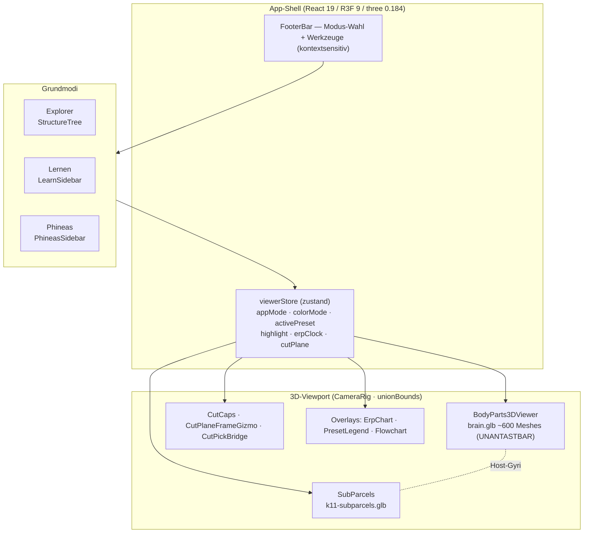
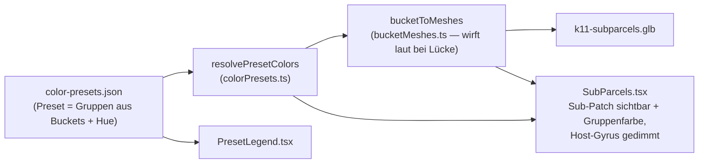
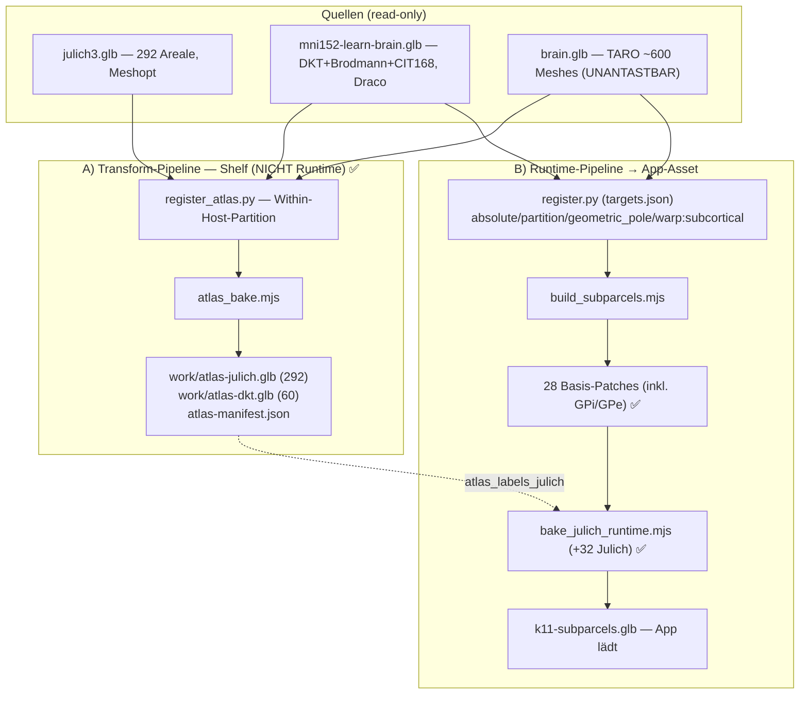
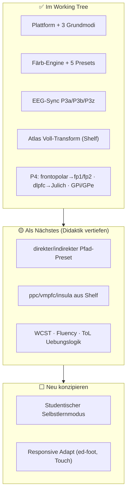

# Masterplan — Kapitel 11 3D-Lern-Experience

> **Zweck:** Eine zentrale Karte über das ganze Projekt — Architektur, was steht, und ein
> vollständiger **Action Plan** (alle Schritte aus allen Sessions, erledigt + offen). Dies ist
> die Roadmap-Ebene; die Detail-SSoT je Strang bleiben die Pläne unter `docs/superpowers/plans/`
> und `scripts/atlas/README.md`.
>
> **Stand:** 2026-06-13 · Branch `feature/grundmodi-steuerleiste`

## Working-Tree-Stand (wichtig)

Der Working Tree enthält die **komplette Arbeit inkl. P4-Runtime-Integration** (frontopolar→fp1/fp2,
dlpfc→Julich, GPi/GPe — **60 Sub-Patches** in `k11-subparcels.glb`): typecheck 0, vitest 48/48,
7 Smokes grün. **Historische Notiz:** P4 fiel zwischenzeitlich einer git-History-Bereinigung zum
Opfer (war noch uncommitted, als die History für das neue GitHub-Repo `Iflands-Neuro-Lernvergnuegen`
neu geschrieben + das Reflog geleert wurde — kein bewusstes Ablehnen). Es wurde aus den überlebenden
`work/`-Artefakten **reproduzierbar wiederhergestellt und committet** (Lehre: P4-Arbeit zeitnah committen).

### Status-Legende

| Symbol | Bedeutung |
| :-- | :-- |
| ✅ | erledigt **und** im Working Tree |
| 🟡 | Geometrie/Vorbedingung steht, Umsetzung (Preset/Szene/Wiring) offen |
| ⬜ | noch zu konzipieren/bauen |

---

## 1. Vision (aus `PRODUCT.md`)

Interaktive 3D-Lern-Experience, die Kapitel 11 (exekutive Funktionen, PFC, Basalganglien-Schleifen,
ERP/VCPT, Phineas Gage) **räumlich** begreifbar macht. Erfolg = Lerninhalt bleibt hängen **und** die
Experience überzeugt durch Qualität (Note, Portfolio). Editoriale Ruhe, ein oranger Akzent, 3D im
Zentrum. **Drei Grundmodi** (kontextsensitive `FooterBar`):

| Modus | Zweck | Sidebar |
| :-- | :-- | :-- |
| **Explorer** | Selbststudium, freier Strukturbaum, Werkzeug-Box (Schnitt, Färbung) | `StructureTree` |
| **Lernen** | Geführte Szenen (Vortrag/Prüfung), Overlays (ERP, Flowchart) | `LearnSidebar` |
| **Phineas Gage** | Animierte Fallstudie (Läsion) | `PhineasSidebar` |

---

## 2. Systemarchitektur



**Färb-Modi** (`ColorMode`): `anatomical · function · laterality · region · preset`.

---

## 3. Subsystem-Status

| Subsystem | Stand | Artefakte |
| :-- | :-- | :-- |
| App-Shell + 3 Grundmodi + FooterBar | ✅ | `FooterBar.tsx`, `viewerStore.ts`, Sidebars |
| Editorial Design (2 Themes, Viewport dunkel) | ✅ Basis · ⬜ Responsive | `src/app.css`, `DESIGN.md` |
| 3D-Viewer (brain.glb, StructureTree, Flyout) | ✅ | `BodyParts3DViewer.tsx`, `StructureTree.tsx` |
| Schnittebenen (Cut/Caps/Gizmo/Pick) | ✅ | `CutCaps.tsx`, `CutPlaneFrameGizmo.ts`, `CutPickBridge.tsx` |
| Figur-Färb-Engine (Presets) | ✅ 5 Presets | `colorPresets.ts`, `bucketMeshes.ts`, `SubParcels.tsx`, `PresetLegend.tsx` |
| EEG/ERP-Sync (P3a/P3b/P3z) | ✅ | `erpAnimation.ts`, `scene/overlays/ErpChart.tsx`, `EegHeadset.tsx`, `IcaSeparation.tsx` |
| Sub-Patch-Geometrie (Runtime) | ✅ 60 Patches (inkl. P4: Julich + GPi/GPe) | `k11-subparcels.glb`, `scripts/atlas/` |
| Atlas Voll-Transform (Shelf) | ✅ 352 Parzellen | `work/atlas-{julich,dkt}.glb`, `atlas-manifest.json` |
| Szenen (Lern-Modus) | ✅ 8 Szenen | `public/scenes/*.json` |

---

## 4. Figur-Färb-Engine (Datenfluss)



**Prinzip „Host gedimmt, Sub-Patch trägt Farbe"** (wie `vlpfc→pars*`): der Gyrus (`brain.glb`) wird
neutral gedimmt, die feineren Sub-Patches (`polygonOffset` gegen Z-Fighting) zeigen die didaktische Farbe.

---

## 5. Atlas-Geometrie-Pipeline

> **SSoT:** `scripts/atlas/README.md`. Kernfakt: `brain.glb` (TARO) und die MNI-Atlanten (Julich/DKT)
> sind **verschiedene Gehirne** → keine globale Registrierung, sondern **Within-Host-Split**.



**Carve-Modi (`targets.json`):** `absolute` (KDTree-Threshold) · `partition` (zentroid-aligned
Within-Host-Split, auch GPi/GPe) · `geometric_pole` (Frontalpol nach mm-Tiefe) · `warp:subcortical`
(eigene Striatum/Pallidum-Affine, LOO 5.4 mm). **Präzisions-Decke:** topologisch/lokal korrekt — ja;
morphometrisch exakt — nein; `backfill:true` = überlappende Näherung.

---

## 6. ACTION PLAN (alle Schritte, erledigt + offen)

> Quellen: 4 Session-Handovers (`docs/END_SESSION_*.md`) + 3 Pläne (`docs/superpowers/plans/`).
> Reihenfolge = chronologisch nach Phase. Verifikations-Standard durchgehend: `pnpm typecheck` 0 +
> `CI=true npx vitest run` grün + Browser-Smoke je Render-Änderung.

### Phase 0 — Brainstorming · Spec · Plan ✅

- [x] Scope geklärt: gemeinsame 3D-Plattform, Hirn als permanenter Anker, Layout „full-bleed + Overlay"
- [x] Rohdaten gesammelt → `raw/` (Kapitel-PDF/OCR, pptx, 40 Bilder), `raw/README.md`
- [x] Spec freigegeben → `docs/superpowers/specs/2026-06-12-kapitel11-3d-lern-experience-design.md`
- [x] Baseline-Plan freigegeben → `docs/superpowers/plans/2026-06-12-kapitel11-3d-lern-experience.md`

### Phase 1 — Baseline-Plattform (A0–F1) ✅

- [x] A0 · `bake-structure-coords.mjs` → `structure-coords.json` (600 Strukturen, Viewer-Raum, Centroid/BBox/Sphere/Surface)
- [x] A1 · `scene/regions.ts` mit verifizierten Slugs (Befund: kein ACC/SMA-Mesh in TARO → ganzer Gyrus)
- [x] B1/C1/C2/D3/D5 · TDD-Logik (brainBridge, scenes/types, router/sceneStore, erpGeometry, nav)
- [x] B2 · `CameraRig` (Fit-to-Highlight aus `structure-coords.json`, `unionBounds`)
- [x] D1/D2/D4 · SceneStage + Overlays (ErpChart, Flowchart, Prose, ImageFallback)
- [x] E1–E3 · 7 Szenen-JSONs (VCPT, P3a/P3b/P3z, Zusammenfassung)
- [x] F1 · `main.tsx` (SceneStage default, `?mode=explore`), Bilder → `public/figures/`, alte slides → archive
- [x] Verifiziert: typecheck 0, vitest 11/11, Playwright-Smoke alle 7 Szenen grün

### Phase 2 — MNI-Subparzellierung 6 Patches (G–K) ✅

- [x] G · `decode_glb.mjs` (Playwright+three, Draco) → TARO + 2 MNI-GLBs nach `work/*.json`
- [x] H · `register.py` H1–H4 (Affine allen→learn→TARO + CPD pro Host + Vertex-Labeling + Gate)
- [x] I · `build_subparcels.mjs` → `k11-subparcels.glb` (6 Patches: `anterior-cingulate`, `sma`, `pre-sma` je l/r)
- [x] J · `SubParcels.tsx` (default-hidden Layer, polygonOffset), `regions.ts` erweitert, P3a/P3z auf Sub-Patches
- [x] K · CameraRig-Anbindung (Sub-Patch-Coords in `structure-coords.json`)
- [x] Verifiziert: Residuen SMA 2.8/3.5, preSMA 2.4/2.2, ACC 1.8/2.2 mm; Gates ≥30 Vertices

### Phase 3 — Grundmodi-Shell ✅ (committed)

- [x] Explorer/Lernen/Phineas als feste Modi, `appMode` im Store, Sidebar-Wahl
- [x] `FooterBar` kontextsensitiv (löst SceneStage ab; `selectMode` aus StructureTree → FooterBar)
- [x] Phineas als fester Modus (`PhineasSidebar`, `LESION_STRUCTURES`)
- [x] Commits `32f76dc … b539ab1` (Runtime-Grundmodi verdrahtet, SceneStage entfernt)

### Phase 4 — Färb-Engine Wave 1 ✅

- [x] W1-A · `colorPresets.ts` (zod-Loader, `resolvePresetColors`, `hueToHex`), `bucketMeshes.ts` (fail-loud), `ColorMode+='preset'`, Apply in `BodyParts3DViewer`, `FooterBar`-Picker, 9 Tests, `smoke-preset`
- [x] W1-B · `register.py` generalisiert (`targets.json`: absolute/partition); 22 Patches (pars\*, rostral/caudal ACC, lateral/medial OFC, accumbens). Befunde: Subkortex-Affine (LOO 5.4 mm), Zentroid-aligned Within-Host-Split. `SubParcels` Preset-Färbung. `smoke-carve`
- [x] W1-C · `PresetLegend.tsx`; Abb. 11-05 Petrides + 11-13 ACC-Bush live; 11-04 freigeschaltet (accumbens). `smoke-figures`
- [x] W1-D · `erpAnimation.ts` (+6 Tests), Store-ERP-Uhr, `ErpChart` rAF-Cursor + Topografie, P3a-Quellen-Puls. `smoke-eeg`
- [x] Verifiziert: typecheck 0, vitest 48/48

### Phase 5 — Wave 2 (Teil) ✅

- [x] frontopolar (BA10) · neuer `geometric_pole`-Modus (vorderste SFG+MFG-Spitze, 22 mm), `combined_hosts.json` → schaltet 11-07 Badre + Phineas frei. `smoke-frontopolar`
- [x] EEG-Sync P3b (parietal) + P3z (SMA/pre-SMA) · `ErpChart` generisch (source/site Cz/Pz), Brain-Puls für brain.glb-Gyri, Headset-Support-Sites und schematische Topografie-/Quellenlabels. `smoke-eeg-p3z`, `smoke-eeg-p3b`
- [x] ICA-Overlay als pausierbare schematische Signal-zu-Komponenten-Animation · gemischtes VCPT-ERP → P3a/P3b/P3z, ohne Rohdatenanalyse-Claim. `smoke-ica`

### Phase 6 — Atlas Voll-Transform → TARO (Shelf-Artefakt) ✅

- [x] P0 · Recon: `julich3.glb` (292, Meshopt) gefunden; Host-Gyrus im Namen
- [x] P1 · `host_map.json` (56 Julich-Suffixe + DKT → TARO-Host); alle Kortex-Gyri decoded
- [x] P2 · `register_atlas.py` (source-agnostisch, eigene Affine pro Quelle): Julich 292/292 + DKT 60/60 gelabelt
- [x] P3 · `atlas_bake.mjs` → `work/atlas-{julich,dkt}.glb` + `atlas-manifest.json` (352 Parzellen, null Drops)
- [x] P-VERIFY · `verify_atlas.py` (6/6 Anordnungs-Checks + Ballooning-Detektor); fixte fp1/fp2-Ballooning (host_restriction)
- [x] Doku · `scripts/atlas/README.md` zur SSoT; CLAUDE.md Atlas-Block
- [ ] (offen/optional) fo3-ofc Voronoi-Imbalance (host_restriction) — nur Shelf, nicht figur-kritisch

### Phase 7 — P4 Runtime-Integration ✅ (wiederhergestellt + committet)

> Reproduzierbar aus den `work/`-Artefakten wiederhergestellt: typecheck 0 / vitest 48/48 / 7 Smokes grün, 60 Patches.

- [x] P4a · `bake_julich_runtime.mjs` (idempotent, carvt verwaltetes Set aus `work/k11-base-28.glb`)
- [x] P4b-fp · `frontopolar`→Julich `fp1/fp2` (löst geometrischen Pol-Carve ab)
- [x] P4b-dlpfc · `dlpfc`→14 Julich-Subareale je l/r (mfg1/2/4, 8v1/2, sfs1/2, sfg2/3/4, 8d1/2, 2 gapmaps); Prämotor/SMA (6\*) aussen vor
- [x] P4d-gpi/gpe · `globus-pallidus`→GPi/GPe (CIT168 within-host-Split, `register.py` partition/warp:subcortical; Quellgeometrie `subcort_gp_extra.json`). Thalamus VA/VLp liegen bereits **nativ** in TARO. Komplementär: left 1359+2104=3463, right 1047+1568=2615
- [x] Tests/Smokes angepasst (`colorPresets.test`, `smoke-preset`, `smoke-figures`, `smoke-frontopolar`); GLB 60 Patches

#### Build-Kette (reproduzierbar)

```bash
cd scripts/atlas
./.venv/bin/python register.py && node build_subparcels.mjs   # 28-Patch-Basis inkl. GPi/GPe
cp ../../apps/brain-app/public/assets/bodyparts3d/k11-subparcels.glb work/k11-base-28.glb
node bake_julich_runtime.mjs                                   # +32 Julich = 60
```

### Phase 8 — Nächste Figuren & Geometrie 🟡⬜

- [ ] 🟡 Preset **direkter/indirekter Pfad** (GPi≠GPe distinkt) — braucht P4-GPi/GPe-Geometrie
- [ ] 🟡 Restliche kortikale Buckets aus Shelf: `ppc`→SPL/IPL (Julich 5/7, PF\*/PG\*) · `vmpfc` · `insula`
- [ ] 🟡 Abb. 11-09 WCST · 11-10 Fluency · 11-11 ToL — fMRT-Aktivierungs-Presets (Geometrie da)
- [ ] ⬜ Abb. 11-06 Fuster (rostrokaudaler Gradient) — Preset/Szene
- [ ] ⬜ Abb. 11-08 A/B/C/D — Flowchart-Szenen (Hierarchie/Kaskade/Konflikt-Typen)
- [ ] ⬜ Abb. 11-12 Flanker — Szene komplett neu (kein Bild im OCR)
- [ ] ⬜ `ifj`→ifj1/2 — erst wenn ein Preset `ifj` referenziert (ifj1-l backfill, ifj2-l 13.2 mm)

### Phase 9 — Experience-Politur ⬜

- [ ] ⬜ Responsive Adapt: `ed-foot`-Steuerleiste (kein Tablet/Phone-Layout), Touch-Targets < 44 px (`DESIGN.md` §Responsive)
- [x] ✅ Phineas-Szene didaktisch ausbauen — Rod-Phasen, Quellen-/Asset-Hinweis, OFC-Flyout
- [ ] ⬜ Export B (PNG/MP4 pro Szene), Topografie-Heatmaps (post-Deadline, dünne Schicht)

### Phase 10 — Optional (Wave 3) ⬜

- [ ] ⬜ Julich-412 aus EBRAINS/siibra regenerieren (zytoarchitektonische Vollebene)
- [ ] ⬜ Subkortex: STN, weitere Thalamus-Kerne

---

## 7. Figur-Inventar & SP5.1-Abdeckung

Die verbindliche SP5.1-Matrix steht in
[`docs/SP5_1_FIGURE_MATRIX.md`](SP5_1_FIGURE_MATRIX.md). Das
Abbildungs-Inventar kommt aus `docs/KAPITEL11_ABBILDUNGEN_MAPPING.md`.
Für SP5.1 zählt nur `done`, was als `replaces_figure` in der Runtime-Config
steht und durch Test oder Browser-Smoke nachgewiesen ist. Historische Presets
ohne Figure-Configuration sind Vorarbeit, aber keine erledigte
Abbildungs-Ersetzung.

| Status | Abbildungen |
| :-- | :-- |
| `done` | 11-04, 11-05, 11-06, 11-07, 11-08A, 11-08B, 11-08C, 11-08D, 11-09, 11-10, 11-11A/B, 11-11C, 11-12, 11-13, 11-14, 11-15(1), 11-15(2), 11-15(3) |
| `open` | keine |
| `blocked` | keine |

**Abgedeckt im SP5.1-Config-Sinn:** 18 Figure/Scene-Ersetzungen.
**Offen für die konkrete Erstellung:** 0 Abbildungs-Einheiten.

---

## 8. Roadmap & Priorisierung



**Empfohlene Reihenfolge:**

1. **direkter/indirekter-Pfad-Preset** — kleinster Schritt, hoher didaktischer Wert (GPi/GPe-Geometrie steht jetzt).
2. **ppc/vmpfc/insula aus dem Shelf** — analog dlpfc, rein additiv, hebt mehrere Presets.
3. **Studentische Check-UI** — Vertrag steht in `docs/STUDENTENMODUS_KONZEPT.md`,
   jetzt fehlen sichtbare Check-Blöcke und Progress-Anzeige.
4. **WCST/Fluency/ToL vertiefen** — vorhandene DLPFC/VLPFC-Steps als erste
   Check-Kandidaten nutzen.
5. **Responsive Adapt** — vor Abgabe/Portfolio einplanen.

---

## 9. Offene Entscheidungen & Risiken

| Punkt | Status / Frage |
| :-- | :-- |
| **GPi vs GPe Farbe** | In 11-04 bewusst gleich (kognitive Schleife = 1 Kreis); distinkt erst im direkt/indirekt-Preset |
| **ifj-Geometrie** | Auf Shelf, aber ifj1-l backfill + ifj2-l 13.2 mm. Nur integrieren, wenn ein Preset es braucht |
| **Julich-412 Vollebene** | Nur via EBRAINS-Regeneration (Wave 3) |
| **Responsive `ed-foot`** | Kein Tablet/Phone-Layout, Touch < 44 px |
| **fo3-ofc Imbalance** | Nur im Shelf-Artefakt, nicht figur-kritisch |
| **Morphometrische Grenze** | Within-Host-Split lokal korrekt, nicht mm-exakt — für didaktische Färbung adäquat |

---

## 10. Prinzipien (gelten überall)

- **`brain.glb` UNANTASTBAR** — Sub-Patches nur additiv in `k11-subparcels.glb`.
- **KEINE stillen Fallbacks** — fehlende Buckets/Slugs/leere Vertex-Sets werfen laut mit Kontext.
- **Evidence-First** — kein „fertig" ohne typecheck 0 / vitest grün / Browser-Smoke.
- **Surgical & Simplicity** — minimaler Code, bestehenden Stil matchen, nur figur-relevante Geometrie.
- **Identifiers ohne Umlaute** (`ae/oe/ue/ss`); Prosa/Kommentare mit echten Umlauten.
- **theme-tokens/ nicht editieren** — Overrides nur in `apps/brain-app/src/app.css`.
- **No-Commit-Konvention** — Checkpoint = Verifikation; Backups per `cp`/`mv` nach `archive/`, nie `rm`.
- **Atlas-SSoT zuerst** — `scripts/atlas/README.md` gewinnt bei Widerspruch zu Erinnerung.

---

## 11. Dokumenten-Index

| Dokument | Inhalt |
| :-- | :-- |
| `PRODUCT.md` · `DESIGN.md` | Produktvision · Design-System (Farben, Typo, Komponenten, Responsive-Notiz) |
| `scripts/atlas/README.md` | **SSoT Atlas-Geometrie** — Quellen, Frames, beide Pipelines, Carve-Modi, Limitationen |
| `docs/superpowers/plans/2026-06-12-kapitel11-3d-lern-experience.md` | Baseline-Plattform A0–F1 |
| `docs/superpowers/plans/2026-06-12-mni-subparcellation.md` | Ur-6-Patch-Pipeline (Fundament) |
| `docs/superpowers/plans/2026-06-12-granulare-faerbemodi.md` | Färb-Engine + EEG-Sync (Wave 1/2) |
| `docs/superpowers/plans/2026-06-12-julich-dkt-voll-transform.md` | Atlas-Transform P0–P3 + Runtime-Integration P4 |
| `docs/KAPITEL11_ABBILDUNGEN_MAPPING.md` | 21 Abbildungen → Bilddatei + 3D-Szenen-Plan |
| `docs/END_SESSION_*.md` | 4 Session-Handovers (chronologische Detail-Historie) |
| `raw/README.md` | Rohdaten Kapitel 11 |
```
