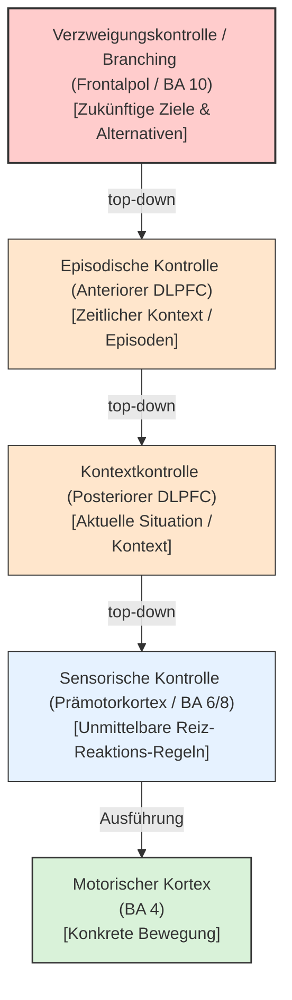

# Kaskadenmodell der hierarchischen Kontrolle

Das **Kaskadenmodell der hierarchischen Kontrolle** (auch *Kaskadenmodell der relationalen Beziehung*, formuliert von Etienne Koechlin und konkretisiert durch David Badre) beschreibt die funktionelle Organisation des [[praefrontaler-kortex|Präfrontalkortex (PFC)]] entlang einer **rostrokaudalen Achse** (von hinten nach vorne).

Zentraler Grundgedanke ist, dass Kontrollsignale kaskadenartig von übergeordneten (rostralen) Hirngebieten auf untergeordnete (kaudale) Areale einwirken. Je weiter anterior (rostral) ein Kortexgebiet liegt, desto komplexer und zeitlich stabiler ist der Kontext, der zur Verhaltenskontrolle herangezogen wird.

Jäncke fasst die gleichen Kapitel-11-Befunde auch unter den Benennungen **Modelle der relationalen Komplexität** und **Modell des Abstraktionsgrades mentaler Repräsentationen**. Gemeint ist jeweils dieselbe rostrokaudale Hierarchie: unten konkrete Reiz-Reaktions-Regeln, weiter vorne kontextuelle und episodische Kontrolle, ganz vorne Branching.

---

## Die vier Kontrollebenen

Das Modell unterscheidet vier hierarchisch gestufte Kontrollprozesse, die von kaudal nach rostral geordnet sind:

### 1. Sensorische Kontrolle (Kaudal)
- **Neuronales Substrat:** Prämotorische Areale (Brodmann-Areal 6 und 8) und prämotorischer Kortex.
- **Mechanismus:** Steuert die Auswahl spezifischer motorischer Reaktionen auf der Basis unmittelbarer sensorischer Reize (z. B. „Drücke Taste A bei grünem Licht, Taste B bei rotem Licht“). Es handelt sich um einfache, feste Reiz-Reaktions-Zuordnungen.

### 2. Kontextkontrolle (Posterior-DLPFC)
- **Neuronales Substrat:** Posteriorer dorsolateraler Präfrontalkortex ([[dlpfc]]) und posteriorer ventrolateraler Präfrontalkortex ([[vlpfc]]).
- **Mechanismus:** Wählt das passende motorische Programm unter Berücksichtigung des aktuellen Kontextes aus. Der Kontext bestimmt, wie ein sensorischer Reiz interpretiert wird (z. B. „Bei rotem Licht an einer Ampel anhalten; wenn jedoch ein Rettungswagen mit Sirene hinter mir steht [Kontext], vorsichtig über die Ampel fahren“).

### 3. Episodische Kontrolle (Anterior-DLPFC)
- **Neuronales Substrat:** Anteriorer DLPFC und anteriorer VLPFC.
- **Mechanismus:** Integriert den zeitlichen Kontext (die „Episode“), um das Verhalten zu steuern. Die Auswahlregeln hängen nicht nur von der aktuellen Situation ab, sondern von vorangegangenen Ereignissen oder Instruktionen (z. B. „Im gestrigen Experiment bedeutete das grüne Licht 'Stopp', im heutigen Durchgang bedeutet es 'Go'“).

### 4. Verzweigungskontrolle / Branching (Rostral)
- **Neuronales Substrat:** Lateraler frontopolarer Kortex / Frontalpol (Brodmann-Areal 10).
- **Mechanismus:** Bildet die Spitze der Hierarchie. Steuert die Verfolgung eines übergeordneten, langfristigen Ziels, während zeitweilig ein Unterziel ausgeführt wird (Multitasking und verzögerte Zielverfolgung). Branching ermöglicht es dem System, ein primäres Vorhaben „auf Eis zu legen“ (zu parken), eine andere Episode abzuarbeiten, und danach fehlerfrei zum Hauptziel zurückzukehren.

---

## Klinische und experimentelle Befunde

### Läsionsstudien
Patienten mit Läsionen in den rostralen Hirngebieten (z. B. Frontalpol) scheitern typischerweise an Aufgaben, die Branching oder episodische Kontrolle erfordern, während sie rein sensorisch gesteuerte Reiz-Reaktions-Zuordnungen problemlos meistern.
- Bei Schädigung des **Frontalpols** sind posteriore Prämotorareale physiologisch voll aktiv, aber das Verhalten ist zerfahren und unkoordiniert, weil die übergeordnete Zielkaskade fehlt (Burgess et al., 2000).
- Eine Unterbrechung der Faserverbindungen zwischen den rostralen und kaudalen Gebieten führt dazu, dass Patienten komplexe Pläne zwar verbal formulieren („Ich muss einkaufen gehen“), aber bei der Ausführung an den konkreten Zwischenschritten scheitern, da die Kontrollsignale die motorischen Areale nicht erreichen.

### Bildgebung (fMRT)
In fMRT-Experimenten zeigt sich ein charakteristisches Muster: Mit steigender Komplexität des zeitlichen Kontexts verschiebt sich die hämodynamische Aktivität kontinuierlich in rostrale Richtung.
- Einfache sensorische Aufgaben aktivieren nur prämotorische Zonen.
- Das Hinzufügen von Kontextregeln rekrutiert den posterioren DLPFC.
- Episodische Wechsel aktivieren den anterioren DLPFC.
- Multitasking- und Branching-Aufgaben bringen selektiv den Frontalpol (BA 10) zur Aktivierung.

## Merkpunkte

- Der Begriff beschreibt ein funktionelles Konzept, das bestimmte Verarbeitungs- oder Verhaltensleistungen erklärt.
- Achte auf die zugehörigen Netzwerke, typischen Leistungsprofile und die Richtung der Störung.
- Für Lokalisation, Befund und Differenzialdiagnose ist die Seite als Einordnungshilfe wichtig.
