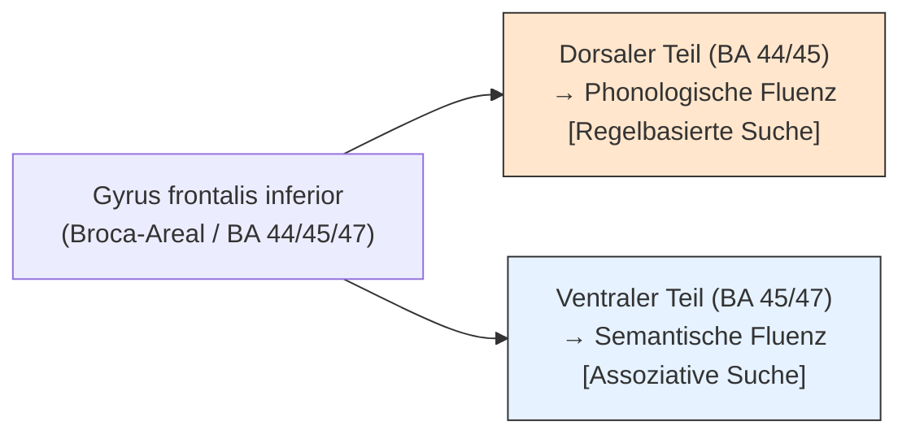

# Flüssigkeitstests (Fluency-Paradigmen)

**Flüssigkeitstests** (Fluency-Tests) sind neuropsychologische Testverfahren zur Erfassung der **Verhaltensinitiierung**, des **lexikalischen Suchprozesses** sowie der **kognitiven Flexibilität**. Sie erfordern das schnelle Generieren von sprachlichen oder figuralen Konzepten unter Zeitdruck (meist 60 Sekunden) bei Einhaltung spezifischer Regeln (Ausschluss von Wiederholungen oder grammatikalischen Variationen).

Unterschieden werden **verbale Flüssigkeitstests** (phonologisch und semantisch) und **figurale/räumliche Flüssigkeitstests** (Design-Fluency).

---

## Verbale Flüssigkeit (Wortflüssigkeit)

Bei verbalen Wortflüssigkeitstests müssen Probanden in einer Minute so viele Wörter wie möglich nach einer vorgegebenen Regel produzieren. Im deutschsprachigen Raum ist der **Regensburger Wortflüssigkeitstest (RWT)** der klinische Standard; im angloamerikanischen Raum wird häufig das **F-A-S-Paradigma** verwendet.

### 1. Phonologische Wortflüssigkeit (Buchstaben-Kriterium)
- **Aufgabe:** Nennen von Wörtern, die mit einem bestimmten Buchstaben beginnen (z. B. „F“, „A“ oder „S“). Eigennamen und Wortwiederholungen sind verboten.
- **Neuronale Grundlagen:** Rekrutiert primär **dorsale Bereiche des Gyrus frontalis inferior** (Brodmann-Areal 44/45, linksseitig dominant) sowie den angrenzenden [[dlpfc]]. Der Prozess erfordert eine anstrengende, unübliche Suchstrategie im mentalen Lexikon.
- **Klinischer Bezug:** Stark beeinträchtigt bei links-frontalen Läsionen sowie bei [[morbus-parkinson|Parkinson-Patienten]] mit frontostriataler Dysfunktion.

### 2. Semantische Wortflüssigkeit (Kategorie-Kriterium)
- **Aufgabe:** Nennen von Wörtern aus einer bestimmten semantischen Kategorie (z. B. „Tiere“, „Lebensmittel“ oder „Berufe“).
- **Neuronale Grundlagen:** Rekrutiert **ventrale Bereiche des Gyrus frontalis inferior** (BA 45/47, linksseitig dominant) sowie temporale Speicherstrukturen. Da die Begriffe im Gehirn assoziativ in Clustern gespeichert sind, ist die Suche natürlicher und weniger kontrollintensiv als bei der phonologischen Suche.
- **Klinischer Bezug:** Auffällig bei Schläfenlappenläsionen sowie als Frühindikator bei der [[alzheimer-krankheit|Alzheimer-Demenz]] (semantischer Speicherzerfall).

---

## Figurale Flüssigkeit (Design-Fluency)

Um exekutive Initiierungsprozesse sprachunabhängig zu messen, werden figurale Flüssigkeitstests eingesetzt.

### Der 5-Punkte-Test (5-Point Test)
- **Aufgabe:** Dem Probanden wird ein Blatt mit mehreren Quadraten vorgelegt, in denen jeweils fünf Punkte (wie auf einer Würfelseite) angeordnet sind. Die Aufgabe besteht darin, innerhalb von 2 Minuten in jedem Quadrat durch das Verbinden der Punkte mit geraden Linien so viele unterschiedliche geometrische Muster wie möglich zu zeichnen.
- **Neuronale Grundlagen:** Aktiviert weite Teile des bilateralen Präfrontalkortex, zeigt jedoch eine **leichte rechtsseitige Aktivierungsdominanz**.
- **Klinischer Bezug:** Besonders sensitiv für Läsionen der rechten Hemisphäre (wo verbale Tests oft unauffällig bleiben) und zur Erkennung figuraler Perseverationen.

---

## Auswertungsparameter und Fehler

Klinisch werden drei Hauptparameter ausgewertet, die Rückschlüsse auf spezifische exekutive Defizite erlauben:

1. **Gesamtanzahl korrekter Nennungen:** Maß für die Verhaltensinitiierung und Suchgeschwindigkeit (Energetisierung).
2. **Perseverationsfehler (Wiederholungen):** Ein Wort oder Muster wird mehrfach produziert. Zeigt eine mangelnde Verhaltenskontrolle und das Festhängen an bereits aktivierten Konzepten (Inhibitionsdefizit, typisch für [[dlpfc]]-Läsionen).
3. **Regelverletzungen (Rule Breaks):** Produktion von Eigennamen, nicht-existierenden Wörtern oder Mustern, die die Linienregeln verletzen. Weist auf ein Defizit im Aufrechterhalten der Aufgabeninstruktion im [[arbeitsgedaechtnis|Arbeitsgedächtnis]] hin.
4. **Wechselverhalten (Clustering & Switching):** Bei semantischer Fluenz wechseln Gesunde systematisch zwischen Unterkategorien (z. B. Hund/Katze/Maus $\rightarrow$ Wechsel $\rightarrow$ Haifisch/Hering/Kabeljau). Fehlendes Switching zeigt mangelnde kognitive Flexibilität.

## Merkpunkte

- Der Begriff beschreibt ein funktionelles Konzept, das bestimmte Verarbeitungs- oder Verhaltensleistungen erklärt.
- Achte auf die zugehörigen Netzwerke, typischen Leistungsprofile und die Richtung der Störung.
- Für Lokalisation, Befund und Differenzialdiagnose ist die Seite als Einordnungshilfe wichtig.
