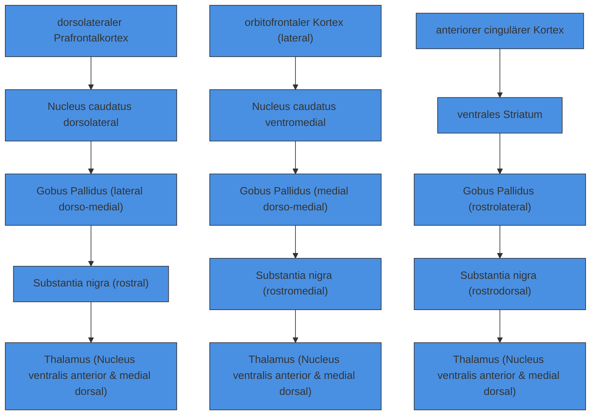
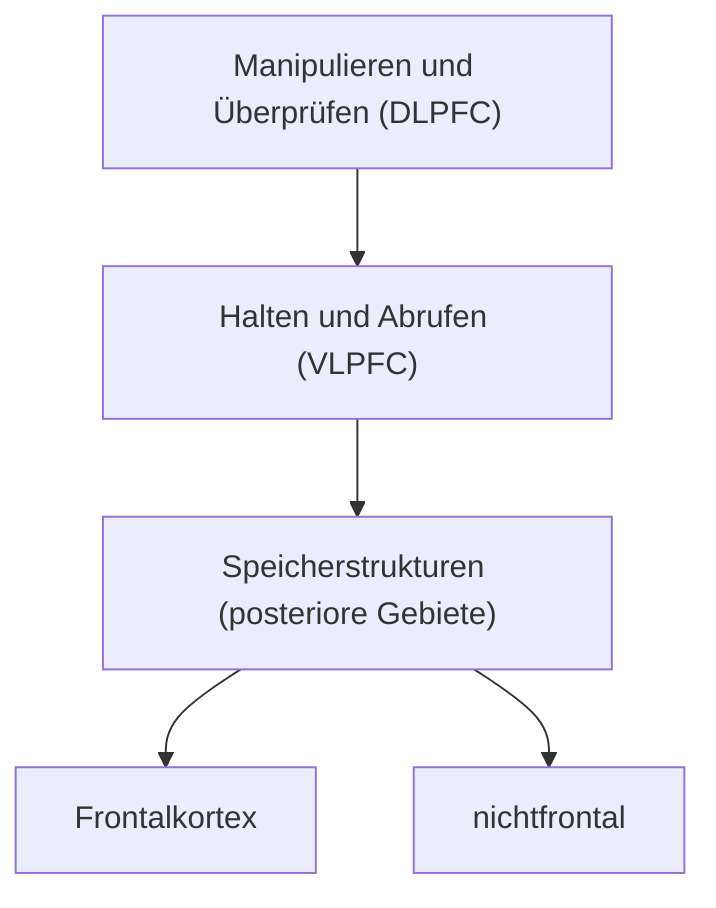
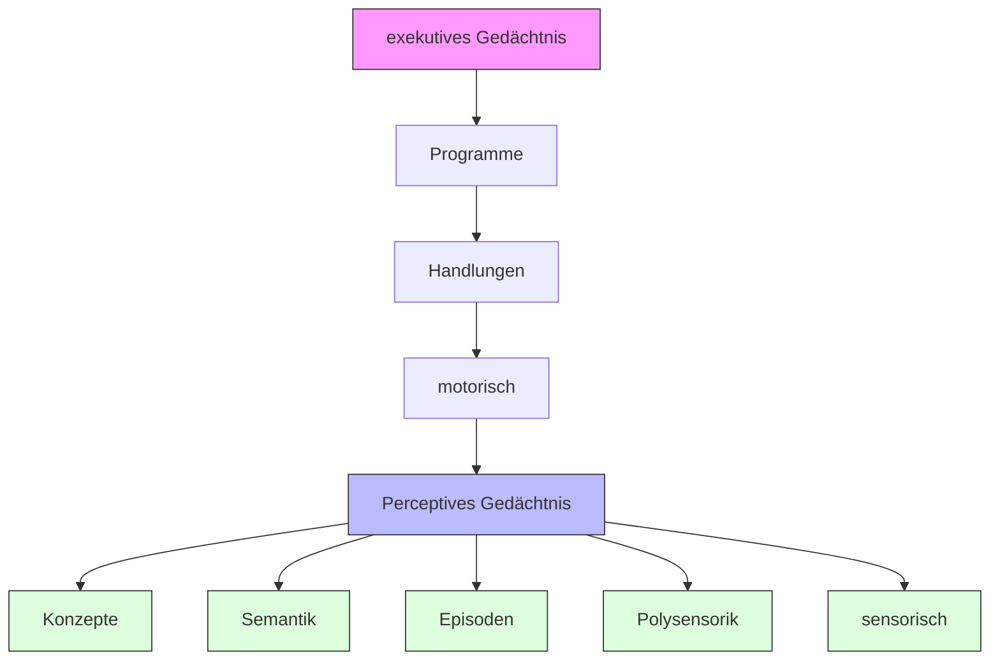
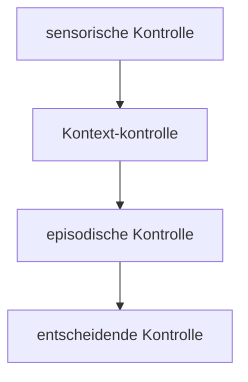
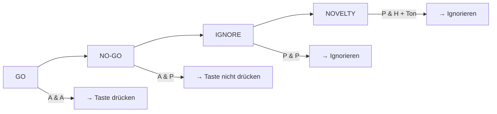

# 11.3.2. Rolle der Basalganglien

Der Frontalkortex ist mit den Basalganglien intensiv bidirektional verbunden. Unterschieden werden drei „Basalganglien-Schleifen“, die in verschiedene Aspekte der EF eingebunden sind: (1) DLPFC-Schleife, (2) VMPFC-Schleife und (3) ACC-Schleife (Abb.11-4). Dyskonnektionsstörungen innerhalb dieser Schleifen führen zu spezifischen Verhaltensauffälligkeiten. Unterschieden wird entsprechend der betroffenen Schleife

(1)ein dorsolaterales Präfrontalhirnsyndrom,
(2) ein Orbitofrontalhirnsyndrom und
(3)ein vorderes cinguläres Syndrom.

Das dorsolaterale Präfrontalhirnsyndrom ist typischerweise mit Problemen in höheren kognitiven Funktionen assoziiert. Hierbei liegen Defizite in der Planung, der kognitiven Flexibilität, der Sequenzierung, beim Gedächtnisabruf, beim Kategoriewechsel sowie Perseverationen vor. Andere Funktionsbereiche wie Sprache, Rechnen und Wahrnehmung sind nicht betroffen, sofern sie nicht von den EF abhängen. Das Orbitofrontalhirnsyndrom ist mit Persönlichkeitsveränderungen, Störungen der Emotionalität und des Sozialverhaltens verbunden. Die Patienten werden impulsiv, mitunter aggressiv, wirken enthemmt, distanzlos und verhalten sich deutlich risikobetonter. Es liegt offenbar eine Störung der Verhaltenshemmung vor. Beeinträchtigungen der cingulären Schleife sind mit Antriebsminderungen in verbunden.

Die Basalganglien gelten als Kerngebiete, die typischerweise in motorische Kontrollprozesse eingebunden sind. Patienten mit Basalganglienstörungen leiden unter motorischen Kontrollproblemen, insbesondere unter dem Problem, Bewegungen zu starten oder zu beenden. Ursache ist eine Degeneration der Substantia nigra, was zur Folge hat, dass zu wenig Dopamin gebildet wird und das gesamte frontostriatale System unter einem Dopaminmangel leidet. Mittlerweile existieren zahlreiche Befunde, die belegen, dass die Basalganglien auch in die Kontrolle von Kognitionen eingebunden sind. Ein wesentlicher Grund dafür ist, dass die Basalganglien über den Thalamus mit dem DLPFC, dem ACC und dem OFC verbunden sind. Das bedeutet, dass sie auch auf Kognitionen und emotionale Prozesse Einfluss nehmen können. In der Tat leiden Basalganglienpatienten neben den motorischen Störungen unter einer Reihe von kognitiven Problemen (Assoziationslernen etc.).

# 11.3.3. Frontalkortex

Dass der Frontalkortex in die Kontrolle der EF eingebunden ist, ist unzweifelhaft. Allerdings ist bislang noch nicht eindeutig geklärt, wie er organisiert ist, um die EF zu kontrollieren.

flowchart

Abbildung 11-4: Drei Basalganglienschleifen. Jede Schleife ist in andere Funktionsbereiche (Kognition, Emotion und Motivation) eingebunden (angelehnt an Alexander et al., 1990 und Müller & Münte, 2009).

Dieses Problem mag auch der Grund dafür sein, dass derzeit viele unterschiedliche Befunde, Modelle und Interpretationen hinsichtlich der Funktion des Frontalkortex vorliegen. Auffällig ist auch, dass Studien an Patienten mit Frontalkortexläsionen und bildgebende Untersuchungen zu Frontalkortexfunktionen nicht immer zu korrespondierenden Ergebnissen führen. Ein weiteres Problem ist die Schwierigkeit der Operationalisierung der EF und der präzisen Abgrenzung von anderen psychischen Funktionen. Wie noch gezeigt wird, sind mit den EF Aufmerksamkeits- und Arbeitsgedächtnisfunktionen verbunden, sodass sie sehr schwer von den EF experimentell und konzeptuell zu trennen sind. Bevor wir uns den speziellen funktionellen Aspekten des Frontalkortex zuwenden, werden allgemeine Funktionsprinzipien des Frontalkortex besprochen.

# 11.4. Modelle der Frontalkortexfunktionen

# 11.4.1. Domänenspezifisch oder funktionsspezifisch

Es wird diskutiert, ob der Präfrontalkortex domänen- oder funktionsspezifisch organisiert ist. Unter einem domänenspezifischen Organisationsprinzip wird verstanden, dass einige Teilgebiete des PFC für bestimmte Modalitäten (auch Domänen genannt) spezialisiert sind. Ein typisches Beispiel wäre, wenn Teilgebiete des PFC in die räumliche Analyse und andere in die Analyse von Objektinformationen eingebunden wären. Der domänenspezifische Ansatz stammt aus der Tierforschung und ist wesentlich durch die Arbeiten von Patricia Goldman-Rakic (1996) geprägt worden. Sie konnte zeigen, dass im Präfrontalkortex des Affen viele Neurone existieren, die spezifisch auf räumliche Informationen ansprechen, während andere auf nichträumliche Informationen ansprechen. Hierbei sollen Neurone oberhalb des Sulcus principalis eher räumliche Informationen bearbeiten (insbesondere kurzzeitig abspeichern, halten und manipulieren), während ventral des Sulcus principalis lokalisierte Neurone eher nichträumliche Informationen (z.B. Gesichts- und Objektinformationen) halten und manipulieren sollen. Einige bildgebende Arbeiten am Menschen schienen diese Befunde zu bestätigen. Die Mehrzahl der bildgebenden Arbeiten konnte allerdings diese Form der Domänenspezifität nicht belegen.

Im Rahmen des funktionsspezifischen Ansatzes wird davon ausgegangen, dass Teilbereiche des PFC für bestimmte kognitive Funktionen spezialisiert sind. Forscher, die sich diesem Ansatz verpflichtet sehen, gehen davon aus, dass bestimmte Subareale des PFC für ganz bestimmte Teilaspekte der EF spezialisiert sind. Zum Beispiel sollen spezifische Teilaspekte der EF wie Wechseln, Initiieren und Hemmen von unterschiedlichen neuronalen Netzwerken innerhalb des Frontalkortex kontrolliert werden. Für die Teilfunktionen des Arbeitsgedächtnisses Halten und Manipulieren scheint sich eine funktionale Spezialisierung bestätigt zu haben, denn es hat sich gezeigt, dass diese in unterschiedlichen Bereichen des PFC verarbeitet werden. Beim Manipulieren von Informationen ist eher der DLPFC aktiv, beim Halten von Informationen der VLPFC (Petrides, 2005; Abb. 11-5). Nicht nur für diese Arbeitsgedächtnisfunktionen konnte eine funktionelle Spezialisierung der PFC-Teilbereiche festgestellt werden, sondern auch für andere Funktionsbereiche. Die Frage ist jedoch, wie spezifisch die Spezialisierung werden kann. Ist es z.B. möglich, dass Teilbereiche der EF wie das Inhibieren, Initiieren und Wechseln von unterschiedlichen Teilstrukturen des DLPFC bearbeitet werden? Diese Frage wird derzeit noch diskutiert.

Die schwerwiegendsten Argumente gegen den funktionsspezifischen Ansatz liefern einige Übersichtsarbeiten, die gezeigt haben, dass identische oder stark überlappende Bereiche des DLPFC und des VLPFC durch unterschiedliche EF-Aufgaben aktiviert werden können (Duncan & Owen, 2000). In diesen Arbeiten konnten also keine spezialisierten

flowchart

Abbildung 11-5: Schematische Darstellung der wichtigsten Funktionen des PFC (nach Petrides, 2005).

Strukturen innerhalb des DLPFC und VLPFC für Teilbereiche der EF gefunden werden, sondern jede EF-Teilfunktion aktivierte die gleichen oder zumindest stark überlappende (und mit den aktuellen Methoden nicht trennbare) Hirngebiete. Der Grund für diese Aktivitätsüberlappung wird in den psychischen Funktionen gesehen, die bei allen EF genutzt werden, d.h. in der Aufmerksamkeit und dem Arbeitsgedächtnis. Wenn diese psychischen Funktionen bei allen oder zumindest den meisten EF-Funktionen beteiligt sind, dann verwundert es nicht, wenn es zu ähnlichen und überlappenden kortikalen Aktivierungen kommt. Kürzlich konnten Duncan und Owen (2006) zeigen, dass bei bestimmten Aufmerksamkeitsaufgaben, die eine bewusste Zuwendung erforderten, aber keine Handlung oder Entscheidung nach sich zogen, ein frontoparietales Netzwerk aktiv war, das auch bei der Bearbeitung von typischen EF-Aufgaben aktiv ist.

# 11.4.2. Hierarchische Modelle

Hierarchische Modelle der funktionellen Organisation des PFC werden derzeit intensiv diskutiert. Eines der ersten hierarchischen Modelle wurde von Joaquin Fuster in den 1990er Jahren vorgestellt und mehrfach weiterentwickelt und präzisiert (Fuster, 2001; Abb. 11-6). Für ihn ist der PFC hierarchisch organisiert. Auf der untersten Ebene befinden sich die primären motorischen Areale, es folgt der PFC und die höchste Hierarchieebene ist der Frontalpol. Je höher die Hierarchiestufe, desto integrativer sind die Funktionen dieser Areale. Auch die posterioren Hirngebiete sind gemäß Fuster hierarchisch organisiert; von den sensorischen Arealen am posterioren Pol des Gehirns bis zu den parietalen Hirngebieten. Die posterioren Hirngebiete sind für die Wahrnehmung und der PFC ist für die Handlungskontrolle zuständig. Beide Hirnsysteme interagieren intensiv miteinander und bilden einen Wahrnehmungs-Handlungs-Zyklus (perception-action-cycle).

flowchart

Abbildung 11-6: Modell der PFC-Funktionen von Joaquin Fuster (nach Fuster, 2001).

Dieses Modell ist eines der ersten hierarchischen Frontalkortexmodelle, die einen Hierarchie-Gradienten auf der rostrokaudalen Achse für den PFC vorschlagen (Abb. 11-7). Auch Fuster unterscheidet drei Teilbereiche des OFC (orbital, medial, lateral), die unterschiedliche Funktionsbereiche abdecken (Emotion, Motivation und Kognition). Das Gemeinsame aller PFC-Bereiche ist die zeitliche Organisation und Integration unterschiedlicher Informationen. Man kann sich die zeitliche Organisation als eine Serien-Parallel-Wandlung vorstellen. Die auf der untersten Stufe vorliegenden, noch sequenziell auf der Zeitachse angeordneten Informationen werden von der übergeordneten Hierarchieebene zu einer (parallelen) Information umgewandelt. Dabei wird diese Serien-Parallel-Wandlung von anderen psychischen Funktionen (z.B. Arbeitsgedächtnis und Aufmerksamkeit) unterstützt.

Diese hierarchische Anordnung von speziellen (in kaudalen PFC-Bereichen kontrollierten) zu allgemeinen und übergeordneten (in rostralen PFC-Bereichen kontrollierten) Funktionsbereichen ist in der Übersichtsarbeit von David Badre (2008) konkretisiert worden. Er unterscheidet vier Gruppen von hierarchischen PFC-Modellen, bei denen die psychischen

text_image

dorsal
dorsolateraler Präfrontalkortex
(bA 9/46)
lateraler Frontopolar-kortex
(bA 10)
anteriorer Prämotorkortex
(bA 8)
prämotor-kortex
(bA 6)
primärer Motorkortex
(bA 4)
ventrolateraler Präfrontalkortex
(bA 47/45/44)
ventraler anteriorer Prämotorkortex
(bA 44/6)
ventral
ventral
posterior
anterior
rostral
kaudal

Abbildung 11-7: Rostrokaudale Organisation des PFC (nach Badre, 2008).

Funktionen auf der rostrokaudalen Achse angeordnet sind (Abb. 11-8): (1) domänenspezifische vs. domänenübergreifende Modelle, (2) Modelle der relationalen Komplexität, (3) das Kaskadenmodell der relationalen Beziehung und (4) ein Modell des Abstraktionsgrades mentaler Repräsentationen. Die letzteren drei Modelle sind konkretere Varianten des PFC-Modells von Joaquin Fuster.

Weiter oben wurden die domänenspezifischen Ansätze zur funktionellen Organisation des PFC besprochen und dabei die ventraldorsale Achse beschrieben. Wie dargestellt, sind die Belege für diese Domänenspezifität widersprüchlich. Allerdings existieren Befunde, die eine domänenspezifische Organisation des PFC auf der rostrokaudalen Ebene nahelegen. Die kaudalen PFC-Bereiche sind hierbei eher in die direkte (domänenspezifische) Kontrolle des Verhaltens bzw. der Motorik eingebunden. So sind die Areale 6 und 8 (prämotorische Gebiete) an der Vorbereitung und Programmierung der aktuellen Motorik beteiligt, während die anterioren Gebiete des PFC eher die übergeordneten Pläne kontrollieren (domänenübergreifend), was durch hohe Korrelationen der Hirnaktivitäten in den kaudalen und rostralen Gebieten während der Bewegungsvorbereitung angezeigt wird. Bei Patienten mit Läsionen in den rostralen Hirngebieten kann man feststellen, dass die posterioren PFC-Gebiete (insbesondere die Prämotorareale) aktiv sind, obwohl es den Patienten nicht gelingt, eine angemessene Bewegung durchzuführen. Offenbar ist die funktionelle Verbindung zwischen den rostralen und kaudalen Gebieten unterbrochen.

Im Rahmen anderer Modelle wird der PFC funktional anhand der Komplexität der mentalen Beziehungen eingeteilt. Hierbei wird der VLPFC als Gebiet betrachtet, welches das Operieren mit einfachen Repräsentationen, z.B. das Behalten von konkreten und einfachen Merkmalen („Das Auto ist rot.“), bewerkstelligt. Auf der nächsthöheren Hierarchieebene wird dann der etwas kaudaler gelegene DLPFC mit einbezogen. Dies tritt ein, wenn z.B. Beziehungen zwischen verschiedenen Merkmalen geknüpft werden müssen („,Das Auto ist rot und zum Transport geeignet.“). Komplexere Beziehungen zwischen verschiedenen Merkmalen erfordern dann den anterioren PFC. Der anteriore PFC ist im Rahmen dieser Modelle die Struktur, welche die komplexesten mentalen Merkmalszusammenhänge bearbeitet. Andere Autoren betonen, dass der anteriore PFC nicht nur an der Verarbeitung von komplexen mentalen Beziehungen beteiligt ist, sondern grundsätzlich aktiv wird, wenn mehrere kognitive Operationen miteinander koordiniert werden müssen. Mentale Beziehungen zwischen verschiedenen Objekten und Merkmalen wären demzufolge nur ein Sonderfall des Operierens mit mehreren kognitiven Operationen.

A)

text_image

domänenspezifisch
domänenübergreifend
abstrakter Plan/Schema
internale Beobachtung

flowchart

B)

text_image

konkretes Merkmal
Beziehung der
1. Ordnung
Beziehung der
2. Ordnung

text_image

Antwort-
konflikt
Merkmals-
konflikt
Dimensions-
konflikt
Kontext-
konflikt

Abbildung 11-8: Schematische Darstellung der hierarchischen rostrokaudalen Organisation Frontalkortex nachgezeichnet nach Badre (2008). (A) Domänenübergreifende zu domänenspezifische rostrokaudale Organisation. (B) Modell der Organisation nach der relationalen Komplexität. (C) Kaskadenmodell der relationalen Beziehung. (D) Modell des Abstraktionsgrades mentaler Repräsentation.

Im Kaskadenmodell werden direkte Einflüsse von übergeordneten auf untergeordnete Hirngebiete angenommen. Die Befürworter dieses Modells sprechen auch von hierarchischen Kontrollsignalen, die in die Verhaltenskontrolle eingreifen. Auf der untersten Ebene sollen z.B. sensorische Verarbeitungsmodule durch Signale aus dem Prämotorkortex beeinflusst werden, sodass die entsprechenden motorischen Programme aufgrund des sensorischen Kontextes ausgewählt werden können (sensorische Kontrolle). Auf der nächsthöheren Ebene nehmen Signale aus anterioren PFC-Bereichen Einfluss auf den Prämotorkortex und leiten die Wahl der motorischen Programme auf der Basis von Kontexteinflüssen (Kontextkontrolle). Weiter anterior liegende Hirnbereiche tragen dann zur Handlungsauswahl bei, indem sie den zeitlichen Kontext mit einbeziehen (episodische Kontrolle). Der frontopolare Kortex trägt auf der höchsten Hierarchieebene zur Verhaltenskontrolle bei, indem Informationen bezüglich des ausstehenden zeitlichen Bezuges zur Verfügung gestellt werden. Diese ausstehenden zeitlichen Bezüge veranlassen das System, Entscheidungen für die zukünftigen Handlungen zu treffen (Verzweigungskontrolle). Von kaudal nach rostral unterscheiden sich die Kontrollsignale im Hinblick darauf, ob unmittelbare sensorische und episodische Informationen, Kontextinformationen oder bevorstehende Informationen aus der Umwelt zur Handlungskontrolle beitragen.

Eine vierte Modellgruppe (Modell des Abstraktionsgrades mentaler Repräsentation) betont nicht die hierarchisch organisierten Kontrollsignale, die quasi von „oben“ nach „unten“ durchgeschaltet werden, sondern die hierarchisch organisierten psychologischen Anforderungen. So können z.B. abstrakte Handlungsanweisungen untergeordnete spezifische Anweisungen bestimmen. Hierbei konkurrieren auf jeder Hierarchieebene verschiedene Repräsentationen miteinander um Ausführung. Mit anderen Worten: Sie erzeugen Konflikte, die gelöst werden müssen. So können auf der abstrakten Ebene verschiedene Repräsentationen von Handlungen miteinander konkurrieren. Welche abstrakte Handlung gewählt wird und zur Ausführung kommt, hängt von Entscheidungen ab, die in anderen Hirngebieten durchgeführt werden. Ist eine Entscheidung auf der obersten abstrakten Ebene getroffen worden, dann werden spezifischere Repräsentationen auf der nächstunteren Ebene aktiviert. Auch hier müssen dann Entscheidungen bezüglich der weiter zu verfolgenden Repräsentationen getroffen werden. Dies setzt sich fort bis in die motorischen Areale.

# 11.4.3. Dorsolaterales präfrontales Kontrollsystem

Anhand der oben aufgeführten Modellvorstellungen ist ersichtlich, dass die theoretische Einordnung der Befunde bezüglich der PFC-

Funktionen nicht einheitlich ist. Im Folgenden werden einige wichtige Befunde hinsichtlich der Beteiligung des DLPFC an der exekutiven Kontrolle dargestellt. Im Vordergrund stehen Befunde aus der Bildgebung, wobei Standardtests zur Überprüfung der exekutiven Funktionen verwendet wurden.

# Verhaltenshemmung und -initiierung

Oft müssen wir liebgewonnene Handlungen, Regeln oder Gedanken unterbinden, um die Möglichkeit zu eröffnen, dass sich neue entfalten können. Dies sind Fähigkeiten, die Patienten mit Läsionen im DLPFC mehr oder weniger ausgeprägt abhanden gekommen sind. Diesen Patienten gelingt es nur mühsam, einmal eingeschlagene Problemlösungswege zu verlassen und neue Problemlösestrategien zu entwickeln. Ihnen gelingt es auch nicht, sich Neuem zuzuwenden, weil die alten Informationen zu dominant sind und sich nicht hemmen lassen. Die hier kurz skizzierten Fertigkeiten werden in der Neuropsychologie mit Standardtests überprüft, die im Folgenden näher dargestellt werden: Wisconsin-Card-Sorting-Test, Stroop-Test und Flüssigkeitstests.

Beim Wisconsin-Card-Sorting-Test werden dem Probanden vier Karten vorgelegt. Eine fünfte Karte, die der Proband einem Kartenstapel entnimmt, soll einer der vier Karten zugeordnet werden. Das Zuordnungskriterium (Farbe, Form oder Anzahl der Symbole) wird dem Probanden nicht mitgeteilt. Findet der Proband über „Versuch und Irrtum“ das gültige Kriterium, erhält er eine positive Rückmeldung vom Untersucher. Das Zuordnungskriterium bleibt für weitere zehn Kartenzüge konstant. Bei der elften Zuordnung wird es spontan und unerwartet für den Probanden vom Versuchsleiter gewechselt. Der Proband muss dann sein zuvor genutztes Kriterium ändern. Gemessen wird, wie lange der Proband benötigt, um das neue Kriterium anzuwenden, und wie oft er die alte Regel anwendet. Das Anwenden einer alten, aber nicht mehr gültigen Regel wird als Perseveration bezeichnet. Eine solche Verhaltensweise zeigen Patienten mit Läsionen im DLPFC. Sie perseverieren auf der alten Regel und können sich nicht auf die neue Regel umstellen.

fMRT-Untersuchungen mit gesunden Probanden während des Lösens des Wisconsin-Card-Sorting-Tests haben ergeben, dass ein frontoparietales Netzwerk aktiv ist. In der Arbeit von Specht und Kollegen (2009) wurden die Aktivierungen während des Lösens von Arbeitsgedächtnisaufgaben mit den Aktivierungen während des Bearbeitens von Wisconsin-Card-Sorting-Test-Aufgaben verglichen. Hierbei zeigten sich bilaterale Aktivierungen im Frontalkortex, und hier insbesondere im DLPFC, im anterioren PFC und im ventrolateralen Präfrontalkortex (VLPFC; Abb. 11-9). Es offenbarte sich allerdings ein Lateralisierungsmuster mit stärkerer Aktivierung im rechtsseitigen VLPFC beim Bearbeiten von Arbeitsgedächtnisaufgaben und stärkerer Aktivierung im rechtsseitigen DLPFC beim Bearbeiten des Wisconsin-Card-Sorting-Tests (Abb.11-9). Hier offenbart sich, dass der VLPFC eher in das Halten und der DLPFC in das Manipulieren von Informationen eingebunden ist. Neben dem PFC waren auch bilateral der Parietallappen und ein Gebiet im linksseitigen Temporallappen aktiv.40

Der Psychologe Ridley Stroop hat 1935 ein nach ihm benanntes Verfahren  den Stroop-Test  vorgestellt, mit dem er die individuelle

Abbildung 11-9: Beispiel für den Wisconsin-Card-Sorting-Test und die mittels fMRT gemessenen Hirnaktivierungen beim Bearbeiten des Wisconsin-Card-Sorting-Test. Bei den Spielkarten repräsentieren die unterschiedlichen Grautönungen unterschiedliche Farben, die hier nicht dargestellt werden können. In den Standardtests werden in der Regel die Farben Rot, Blau, Grün und Gelb genutzt. Man erkennt, dass beim Wisconsin-Card-Sorting-Test bilaterale Durchblutungssteigerungen im Präfrontalkortex (PFC) auftreten. (Nach Specht et al., 2009)

Interferenzneigung bei der Farb-Wort-Interferenz gemessen hat. Dieser Test besteht aus Farbworten, die in unterschiedlichen Farben geschrieben sind. Es gibt kongruente und inkongruente Bedingungen. In den kongruenten Bedingungen ist das Farbwort in der Farbe geschrieben, die es benennt. Das Wort „rot“ erscheint dann in roten Buchstaben, das Wort „blau“ in blauen. In den inkongruenten Bedingungen ist das jeweilige Farbwort in einer anderen Farbe dargestellt; das Wort „blau“ kann in gelben Buchstaben dargestellt sein. In den inkongruenten Bedingungen geraten die Probanden immer in einen Konflikt, insbesondere wenn sie die Farbe benennen sollen, in der das Wort geschrieben ist. Dieser Konflikt resultiert in längeren Antwortzeiten als bei der Übereinstimmung von Farbname und Wortfarbe. Er ist darin begründet, dass die Person das Wort automatisch lesen muss (weil Lesen in unserem Kulturkreis bei den meisten Menschen automatisiert ist), obwohl sie den Wortinhalt nicht beachten soll. Sie kann das Lesen nicht unterdrücken. Die Farbwahrnehmung ist weniger automatisiert. Um die Benennung der Farbe zu gewährleisten, muss das automatisierte Lesen gehemmt werden. Dieser Konflikt zwischen der stark überlernten und automatisierten Lesefähigkeit und der weniger automatisierten Farbbenennung wird vom Cingulum und vom lateralen Präfrontalkortex verarbeitet.

Kürzlich konnte gezeigt werden, dass bei solchen Konflikten auch ein Hirngebiet an der Schnittstelle zwischen dem ventralen und dorsalen Präfrontalkortex aktiv wird, das an der Verbindungsstelle zwischen dem Sulcus frontalis inferior und dem Sulcus praecentralis inferior liegt (inferiores frontales Kreuzungsareal; Derrfuss et al., 2012).

Frontalhirnpatienten leiden auch darunter, dass sie ineffizient mit neuen kognitiven Anforderungen umgehen. Untersucht wird dies mit sogenannten Flüssigkeitstests. Typische Aufgaben sind die verbalen Flüssigkeitstests. Hierbei erhalten die Probanden die Aufgabe, innerhalb einer vorgegebenen Zeitspanne so viele Wörter wie möglich mit einem bestimmten Anfangsbuchstaben zu bilden. Im angloamerikanischen Sprachraum werden oft die Anfangsbuchstaben $, \mathrm { F } ^ { \alpha } , , \mathrm { A } ^ { \alpha }$ und „S“ genutzt. Im deutschsprachigen Raum wird der Regensburger Wortflüssigkeitstest verwendet, der neben der Aufgabe, anhand bestimmter Anfangsbuchstaben Wörter zu bilden, auch semantische Flüssigkeitsaufgaben anbietet. Mit einem weiteren Flüssigkeitstest kann die Fä- higkeit, neue räumliche Muster zu produzieren, gemessen werden. Ein gebräuchlicher Test ist der 5- Punkte-Test, bei dem die Probanden nacheinander vorgegebene Punkte mit Linien verbinden müssen, um neue Figuren zu zeichnen.

fMRT-Untersuchungen während des Lö- sens von solchen Flüssigkeitsaufgaben haben Beim Wisconsin-Card-Sorting-Tests (WCST) sind bilateral der DLPFC, der VLPFC und parietale Hirngebiete aktiv. Unterschiede zu den Aktivierungen beim Lösen von Arbeitsgedächtnisaufgaben findet man im rechtsseitigen VLPFC (bei Arbeitsgedächtnisaufgaben stärker als bei WCsT-Aufgaben) und im rechtsseitigen DLPFC (bei WCST-Aufgaben stärker als bei Arbeitsgedächtnisaufgaben).

gezeigt, dass bei diesen Aufgaben insbesondere weite Teile des Frontalkortex (dorsolateral und ventrolateral) aktiv sind. Diese Untersuchungen haben eine Besonderheit ergeben: Beiphonologischen Flüssigkeitsaufgaben, also Aufgaben, bei denen die Probanden in einer bestimmten Zeit so viele Wörter wie möglich finden müssen, die mit einem bestimmten Anfangsbuchstaben beginnen, sind dorsale Bereiche des Gyrus frontalis inferior aktiviert. Bei semantischen Flüssigkeitsaufgaben sind die Durchblutungszunahmen etwas weiter ventral verortet (Costafreda et al., 2006; Abb. 11-10). Bei räumlichen Flüssigkeitsaufgaben zeigen sich ebenfalls Durchblutungszunahmen im Präfrontalkortex, allerdings mit einer leichten rechtsseitigen Aktivierungsdominanz.

text_image

1
4 2 5
3

Abbildung 11-10: Schematische Darstellung der Hirnaktivierungen bei verschiedenen Flüssigkeitsaufgaben. (1) Bei phonologischen Flüssigkeitsaufgaben,(2) bei semantischen Flüssigkeitsaufgaben, (3) während des Aufgabenwechsels, (4) beim Initiieren und Auswählen und (5) beim Ausführen von Bewegungen.

# Verhaltensplanung

Planen wird definiert als der zielgerichtete Versuch, erworbenes Wissen für zukünftige Handlungen optimal einzusetzen. Wer keinen Plan hat, sieht sich außerstande, den Anforderungen, die aktuell oder zukünftig an ihn gestellt werden, durch geeignetes Verhalten vorausschauend zu begegnen. Zur Untersuchung von Planungsprozessen werden häufig Varianten des Tower-of-London-Tests (ToL) verwendet. Der ToL-Test, der auch als Tower-of-Hanoi-Test existiert, liegt in verschiedenen Versionen vor. Das Grundprinzip dieses Tests ist bei allen Versionen identisch. Der Test besteht aus mehreren Stäbchen, die nebeneinander angeordnet sind. Auf diesen Stäbchen sind Kugeln in unterschiedlichen Farben aufgesteckt. Die Versuchsperson hat die Aufgabe, die Kugeln von einer Ausgangsposition in eine andere Position zu verlagern und dabei bestimmte Regeln einzuhalten. Diese Regeln können je nach Version variieren. Eine häufig angewendete Regel ist, immer nur eine Kugel pro Zug zu bewegen. Gemessen werden die Zeit und die Anzahl der Züge, die benötigt werden, um die Aufgabe zu lösen. Je nach Anzahl der Kugeln und Stäbchen kann die Schwierigkeit variiert werden. Für die verschiedenen Varianten des ToL-Tests existieren umfangreiche Normen. Untersuchungen mittels der funktionellen Magnetresonanztomografie haben ergeben, dass während des Lö- sens von ToL-Aufgaben insbesondere der dorsolaterale Präfrontalkortex aktiviert ist. Die Aktivierungen nehmen mit der Anzahl der notwendigen Züge und mit der Schwierigkeit der Aufgabe zu (Unterrainer & Owen, 2006; Abb. 11-11).

C)

scatter

DLPFC
| Schwierigkeit | Blutflusszunahme | Error Bar (±) |
| :--- | :--- | :--- |
| Rest | 51.1 | 0.5 |
| 1 | 52.1 | 0.5 |
| 2 | 52.5 | 0.5 |
| 3 | 52.8 | 0.5 |
| 4 | 53.5 | 0.5 |
| 5 | 53.2 | 0.5 |

Abbildung 11-11: (A) Beispiel für ToL-Aufgabe und (B) typische fMRT-Aktivierung beimLösen der ToL-Aufgabe (nach Unterreiner & Owen, 2006). (C)Rechts erkennt man die hämodynamischen Reaktionen im DLPFC in Abhängigkeit von der Schwierigkeit der Aufgabe.

Andere Tests, mit denen exekutive Funktionen überprüft werden können, sind der Six-Elements-Test und der Executive-Route-Finding-Test. Bei dem Six-Elements-Test wird die Fähigkeit überprüft, sechs einfache Aufgaben (2 Reiseberichte diktieren, 2 Rechenaufgaben lösen und 2 Objekt- und Bilderbenennungsaufgaben) zeitlich zu planen und bei der Durchführung die einzelnen Zeitbeschränkungen einzukalkulieren. Beim Executive-Route-Finding-Test bekommen die Patienten die Aufgabe, ein bestimmtes Zimmer in einem mehrstöckigen Gebäude zu finden, ohne vom Untersuchungsleiter Hinweise zu erhalten. Bewertet werden Instruktionsverständnis, Strategien zur Informationssuche, das Behalten von Anweisungen, die Handlungskontrolle, die Fehlerkorrektur sowie das zielgerichtete Verfolgen der Aufgabe. Mittlerweile liegen auch einige neue Computerversionen von Planungstests vor. Besonders hervorzuheben sind der Plan-aday-Test und das Norderstedt-Adventure von Funke (2003). Diese Tests sind nicht nur als Diagnoseinstrumente konzipiert, sondern bieten auch vielfältige Möglichkeiten zum Training von Planungsfertigkeiten.

# Selbstkontrolle

Insbesondere der rechtsseitige DLPFC ist in die Selbstkontrolle eingebunden, wobei dieses Gebiet im Sinne einer Top-down-Kontrolle die angeschlossenen Hirngebiete (VLPFC, VMPFC, limbisches System und Basalganglien) kontrolliert und in der Regel hemmt. Über den DLPFC können wir unsere Gefühle, Antriebe und Intentionen kontrollieren. Selbstkontrolle reicht etwas weiter als die oben besprochene Verhaltenshemmung. Wird der rechtsseitige DLPFC gehemmt (z.B. mittels niederfrequentem rTMS oder kathodaler tDCS), reduziert sich die vom DLPFC ausgeübte Top-down-Hemmung und die Probanden werden risikoreicher und ungehemmter (Knoch, 2007). Gleichzeitig neigen sie auch zunehmend eher dazu, sich von der Realität zu entfernen und virtuelle Realitäten als real aufzufassen (Jancke et al., 2009).

# 11.4.4. Ventromediales präfrontales System

Die wichtigste Funktion des ventromedialen Präfrontalkortex ist die Verhaltenshemmung. Über den VMPFC werden gelernte Regeln, die mit ihnen verbundenen Emotionen, Verstärkung und Bestrafung wirksam. Patienten mit bilateralen Läsionen des VMPFC erbringen weitgehend normale Leistungen in neuropsychologischen Tests (z.B. in Tests zur Messung des Arbeitsgedächtnisses, der Aufmerksamkeit und des Gedächtnisses), in ihrem Alltagsverhalten sind sie jedoch massiv auffällig. Sie wirken sozial unangepasst, schwanken zwischen Euphorie und Trauer, lachen in unangemessenen Situationen, sind gelegentlich apathisch oder werden aggressiv. Eine wesentliche Ursache ihres Verhaltens ist, dass sie die Konsequenzen ihres Verhaltens nicht erkennen und zur Kontrolle einsetzen können. Das hat auch Auswirkungen auf die Kontrolle von zukünftigem Verhalten. Diese Patienten können ihr Verhalten nicht planen, denn sie können auch die möglichen Konsequenzen des zukünftigen Verhaltens nicht abschätzen. Dadurch wird ihr Verhalten momentbezogen und selbstgenügsam. Auch fehlt es ihnen an Einsicht in ihre Verhaltensprobleme. Antonio Damasio nennt dieses Verhalten erworbene Soziopathie.

Der französische Neurologe Francois Lhermitte (Lhermitte, 1986; Lhermitte et al., 1986) beschrieb weitere Symptome bei Patienten mit Läsionen im VMPFC und bezeichnete sie zusammenfassend als Umweltabhängigkeitssyndrom (environmental dependency syndrome). Diese Patienten fielen durch ein übertriebenes Imitations- sowie durch Utilisationsverhalten auf. Das übertriebene Imitationsverhalten zeigte sich in den Interviewsituationen, die Lhermitte mit diesen Patienten erlebte. Die Patienten imitierten spontan Gesten, mimische Ausdrücke und komplexe Handlungsfolgen des Interviewers. Unter dem Utilisierungsverhalten41 verstand Lhermitte die übertriebene Abhängigkeit des Verhaltens der Patienten von externen Reizen. Das Verhalten wird stimulusgetrieben und weniger abhängig von internen Motiven. Sehen diese Patienten ein Glas vor sich, dann gießen sie Wasser hinein. Platziert man einen Hammer vor ihnen, beginnen sie zu hämmern. Sie führen Handlungen aus, die mit den Objekten der Umwelt assoziiert sind.

# Parietales Kontrollsystem

Wie oben dargestellt, ist ein weit verteiltes Netzwerk an der exekutiven Kontrolle beteiligt, das nicht nur den Frontalkortex, sondern auch andere Hirngebiete einschließt. Eine wichtige Struktur ist der Parietallappen, der vielfältig zur exekutiven Kontrolle beiträgt, z.B.:

Aufmerksamkeitslenkung (Kap. 10)
motorische Transformationen (Kap. 12)
Fremd- und Eigenunterscheidung.

Wie bereits dargestellt, ist die Aufmerksamkeitslenkung eine wesentliche Komponente der EF. Im Grunde wird über die EF die

Aufmerksamkeit auf bestimmte Funktionsbereiche gelenkt. Insofern ist es nicht verwunderlich, dass eine für die Aufmerksamkeit wichtige Hirnstruktur wie der Parietallappen in die exekutive Kontrolle eingebunden ist. Bei der exekutiven Kontrolle werden auch Handlungen vorbereitet, sequenziert, kontrolliert und an die Umweltgegebenheiten angepasst. Das bedeutet, dass motorische Kontrollprozesse mit eingebunden werden müssen. Die mit eingebundenen Kontrollprozesse sind im Wesentlichen motorische Transformationen (sensomotorische Transformationen, kinematische Transformationen und Werkzeugtransformationen), die vorwiegend im Parietallappen ausgeführt werden (insbesondere im intraparietalen Sulcus).

Letztlich wird über das Parietallappensystem das Körperwissen und die Fähigkeit zur Fremd- und Eigenunterscheidung mit in die Entscheidung eingebunden. Denn wenn ein Individuum seine Handlungen plant, muss es wissen, wer der Agent der Handlung ist. Vor allem aufgrund von Läsionsstudien ist bekannt, dass insbesondere der rechtsseitige Parietallappen (vorwiegend der inferiore Parietallappen mit Übergriff auf den Okzipitalkortex) das Körperwissen verarbeitet und auch die Zuordnung zum Handelnden vornimmt. Läsionen in diesen Hirngebieten führen zur Asomatognosie (Leugnen der Zugehörigkeit einer Extremität), zur Somatoparaphrenie (die eigene Extremität wird einer anderen Person zugeschrieben) und zur Anosodiaphorie (eine schwere Krankheit wird als Lappalie bewertet).

# Cinguläres Kontrollsystem

Im Aufmerksamkeitsmodell von Posner und Petersen wird dem anterioren Cingulum (als wichtigem Bestandteil des anterioren Netzwerks) eine zentrale Rolle im „exekutiven Kontrollsystem“ zugeschrieben (Kap. 10). Es soll wichtige Funktionen bei der willentlichen Aufmerksamkeitskontrolle, bei der Inhibition, dem Aufgabenwechsel, der Konfliktlösung, der Ressourcenzuteilung und bei Planungsprozessen übernehmen. Eine wichtige und in vielen Studien immer wieder beschriebene Funktion, die mit dem ACC in Verbindung gebracht wird, ist die Konfliktlösung und -bearbeitung. Immer wenn Konflikte vorliegen, welches Verhalten bei einer bestimmten Reizsituation zu wählen ist, ist das ACC aktiv. Zur Untersuchung von Konflikten werden typischerweise Stroop-Aufgaben (s.o.) oder Flanker-Aufgaben eingesetzt. Bei den Flanker-Aufgaben wird den Versuchspersonen eine Reihe von Zeichen dargeboten. Dies können z.B. fünf Buchstaben sein. Die Probanden müssen allerdings nur auf den mittleren Buchstaben achten, denn der ist für die zu tätigende Reaktion wesentlich. Die Aufgabe könnte darin bestehen, dass der Proband auf die rechts angeordnete Reaktionstaste drücken soll, wenn in der Mitte ein /S/ steht. Steht in der Mitte ein /H/, bestünde die Aufgabe darin, auf eine links angeordnete Taste zu drücken. Werden fünf /S/ oder fünf /H/ nebeneinander dargeboten, ist die Aufgabe relativ einfach zu lösen, denn die Information ist eindeutig (kongruente Bedingung; Abb. 11-12). Wenn allerdings ein /S/ in der Mitte steht, das rechts und links jeweils von zwei /H/ flankiert ist (HHSHH), dann wird die Aufgabe schwieriger. Die flankierenden Buchstaben fordern implizit zum Drücken der links angeordneten Reaktionstaste auf. Auch die umgekehrte Buchstabenanordnung (ein /H/ in der Mitte mit flankierendenssss) ist relativ schwierig, denn die flankierenden Buchstaben fordern implizit zum Drücken der rechts angeordneten Taste auf (inkongruente Bedingung). In den inkongruenten Bedingungen entsteht ein Konflikt, der zu längeren Reaktionszeiten führt. Dieser Konflikt ist typischerweise mit Durchblutungszunahmen im ACC verbunden.

Auch bei Anwendung des klassischen Stroop-Tests zeigen sich typischerweise Durchblutungszunahmen im ACC. Der Stroop-Test wurde in einigen Untersuchungen zu einem

<table><tr><td>kongruent</td><td>inkongruent</td></tr><tr><td>SSSSS</td><td>SSHSS</td></tr><tr><td>HHHHH</td><td>HHSHH</td></tr></table>

Abbildung 11-12: Typische Flanker-Aufgabe. Der Proband hat die Aufgabe, auf den in der Mitte stehenden Buchstaben zu achten. Ein in der Mitte stehendes /S/ verlangt das Betätigen einer rechts angeordneten Taste, während ein in der Mitte stehendes /H/ das Drücken der links angeordneten Taste erfordert. Werden in einer Reihe die gleichen Buchstaben dargeboten, dann liegt eine kongruente Bedingung vor. Wird der in der Mitte stehende Buchstabe von anderen Buchstaben flankiert, die mit der anderen Reaktion assoziiert sind, dann liegt eine inkongruente Bedingung vor.

emotionalen Stroop-Test modifiziert (Mathews & MacLeod, 1985). Hierbei werden den Probanden emotional „geladene“ Wörter in unterschiedlichen Farben dargeboten. So kann z.B. das Wort „Trauer“ in Rot, das Wort „Freude“ in Grün oder das Wort „Tod“ in Blau präsentiert werden. Die Probanden haben die Aufgabe, die Farbe der dargebotenen Wörter zu benennen. Die Farbbenennung ist bei Personen verlangsamt, die eine besondere emotionale Beziehung zu dem emotionalen Wort haben, das gerade dargeboten wird. Ein depressiver Proband zeigt z.B. eine verlangsamte Farbbenennung bei der Präsentation des Wortes „Trauer“. Auch gesunde Probanden lassen sich durch die emotionalen Wörter beeinflussen. Die Farbbenennungen für emotionale Wörter (z.B. „Krieg“, „Tod“, „Krankheit“, „Krebs“) erfolgen immer etwas langsamer als für neutrale Wörter. Die Verlangsamung kommt wahrscheinlich dadurch zustande, dass das negative emotionale Wort die Aufmerksamkeit von der aktuellen Aufgabe (Benennung der Farbe) ablenkt. Trotz allem kommt es zu einem Konflikt zwischen der Benennung der Farbe und des Wortes. Auch bei solchen emotionalen Stroop-Aufgaben ist das

ACC aktiv. Allerdings findet sich die Aktivität nicht in den gleichen Arealen des ACC wie bei klassischen Stroop-Aufgaben. Die klassischen Stroop-Aufgaben führen eher zu Aktivierungen im dorsalen ACC, während die emotionalen Stroop-Aufgaben mit Aktivierungen im ventralen Teil des ACC assoziiert sind (Bush et al., 2000).

Auch elektrophysiologisch kann die Beteiligung des ACC an der Verhaltenskontrolle nachgewiesen werden. Wenn die Probanden bei Flanker-Aufgaben (oder Stroop-Aufgaben) Fehler machen, dann kann über dem Vertex die Error-Related Negativity (ERN) ca. 80- 150 ms nach dem Begehen des Fehlers gemessen werden. Es handelt sich hierbei um eine Negativierung, deren Quellen dem ante-

text_image

dorsales ACC
kognitiver Teil
ventrales ACC
emotionalerTeil

Abbildung 11-13: Schematische Darstellung der Ergebnisse von Bush und Kollegen (200o). Der dorsale Teil des ACC ist eher in die Verarbeitung kognitiver Konflikte eingebunden. Kognitive Konflikte entstehen bei den typischen Stroop-Aufgaben mit den Farbwort-Farb-Interferenzen. Deshalb wird dieser Teilbereich des ACC auch als kognitiver Teil bezeichnet. Der ventrale Teil des ACC reagiert besonders stark bei emotionalen Stroop-Aufgaben. Dieser Bereich wird deshalb als emotionaler Teil des ACC bezeichnet.

rioren Cingulum zugeschrieben werden. Die Komponente wird durch dopaminerge Signale aus den Basalganglien (Nucleus accumbens) und dem Mittelhirn (ventrales Tegmentum) „getrieben“. Offenbar ist das ACC bereits sehr früh in die Verhaltenskontrolle eingebunden.

Die oben dargestellten Befunde werden in der Regel als Evidenz für die Beteiligung des ACC an der Lösung von Konflikten interpretiert. Allerdings zeigen andere Untersuchungen, dass das ACC auch an anderen Prozessen beteiligt ist. So konnte z.B. nachgewiesen werden, dass beim Verarbeiten von zurückgemeldeten Informationen (z.B., wenn die Korrektheit einer Reaktion angezeigt oder der Erhalt der Belohnung bemerkt wird) das ACC aktiv ist. Auch bei der Fehlervermeidung findet sich eine stärkere Aktivität im ACC. Bemerkenswert ist, dass Patienten mit Läsionen im ACC bei Konfliktaufgaben eher unauffällig sind. Deshalb wird vermutet, dass das ACC eher an der Kontrolle der Motivation beteiligt ist. Das würde bedeuten, dass der Antrieb, sich mit Konflikten oder den Problemen der Verhaltenskontrolle auseinanderzusetzen, über das ACC kontrolliert würde.

# Der visuelle Konzentrationsverlaufstest

Neben den oben dargestellten Flanker- und Stroop-Aufgaben werden in den kognitiven Neurowissenschaften auch häufig sogenannte Go-/No-go-Aufgaben eingesetzt. Im Prinzip funktionieren die Aufgaben so, dass die Versuchspersonen bei einem bestimmten Reiz schnell reagieren müssen (indem sie zum Beispiel eine Reaktionstaste niederdrücken), während sie bei einem No-go-Reiz nicht reagieren sollen. Eine besondere Variante von Go-/No-go-Aufgaben sind die cued-Go-/Nogo-Aufgaben. Die Reize werden bei diesem Aufgabentyp nacheinander dargeboten. Dabei kann ein bestimmter Reiz als Hinweisreiz für einen folgenden Go-Reiz dienen. Das heißt, dass die Versuchsperson sich nach dem Hinweisreiz auf den möglicherweise in der Folge erscheinenden Go-Reiz vorbereiten kann. Wird der Go-Reiz tatsächlich dargeboten, kann die Person die Reaktion auslösen. Erscheint allerdings der No-go-Reiz, muss sie die bereits vorbereitete Reaktion unterbinden bzw. hemmen. Mit solchen Versuchsanordnungen kann man recht elegant verschiedene psychologische Prozesse im Zusammenhang mit exekutiven Funktionen und den damit verbundenen neurophysiologischen Grundlagen untersuchen.

Eine interessante Variante dieser Go-/Nogo-Aufgaben ist der sogenannte visuelle Konzentrationsverlaufstest (Visual-Continuous-Performance-Test, VCPT) (Abb. 11-14). Dabei werden verschiedene Bilder nacheinander (getrennt durch ein Intervall von einer Sekunde Dauer) dargeboten. Dies können zwei Bilder von Tieren (A-A, A für animal) sein, Bilder von Tieren und Pflanzen (A-P, P für plants), zwei Pflanzen (P-P) oder ein Bild von einer Pflanze gefolgt von einem Bild, welches einen Menschen bei der Arbeit darstellt (P-H, H für human). Die Versuchspersonen sollen allerdings nur auf den zweiten Reiz der Bedingung A-A reagieren. Das zweite Tierbild dient demzufolge als Go-Reiz. Folgt dem ersten Tierbild allerdings kein weiteres Tierbild, sondern das Bild einer Pflanze (A-P), müssen die Versuchspersonen die vorbereitete Reaktion hemmen. Das Bild der Pflanze dient demzufolge als No-go-Reiz. Die anderen Bildfolgen sind Kontrollbedingungen, die für die Abschätzung von sensorischen Funktionen und Aufmerksamkeitsfunktionen wichtig sein können.

Personen, welche Schwierigkeiten haben, eine bereits vorbereitete Reaktion zu hemmen, werden bei Erscheinen der No-go-Reize recht häufig fälschlicherweise die Reaktionstaste betätigen (commission error). Manche Versuchspersonen reagieren verzögert oder sehr variabel auf die Go-Reize. Sie können auch manchmal nicht auf Go-Reize reagieren (ommission error). Interessanter sind neben den Verhaltensauffälligkeiten aber vielmehr die ERPs, die in den Go- und No-go-Bedingungen gemessen werden können. Diese ERPs geben uns Aufschluss über die während und vor der Reaktion stattfindenden neurophysiologischen Prozesse. Demzufolge können wir mit diesen speziellen ERPs mehr erfahren als alleine durch die Verhaltensparameter.

flowchart

Abbildung 11-14: Visueller Konzentrationsverlaufstest (VCPT) (mit Dank von Dr. Andreas Müller überlassen (nach Müller et al., 2011).

Eine interessante und lohnenswerte Strategie diese ERPs auszuwerten besteht darin, sie in Teilkomponenten zu zerlegen. Dies macht man mit einem bestimmten mathematischen Verfahren (independent component analysis: ICA). Nach der Zerlegung mittels der ICA erhält man neue, voneinander unabhängige ERPs, die unterschiedliche Topografien und auch unterschiedliche intrakortikale Quellen (also Hirngebiete, die zur Aktivierung beitragen) aufweisen. Jede dieser unterschiedlichen ERPs repräsentieren neurophysiologische Prozesse, die mit bestimmten Aspekten der exekutiven Funktionen verbunden sind. Mit dieser ICA-Methode kann man drei für die exekutiven Funktionen wichtige ERP-Komponenten herausarbeiten: (1) Die fronto-zentrale P3a-No-go-Komponente, (2) die parietale P3b-Go-Komponente, (3) die zentro-frontale P3z-Komponente (siehe hierzu auch Abb. 11-15).

Konfliktmonitoring

line

| Point | Red Line | Green Line |
|-------|----------|------------|
| 1     | 0.0      | 0.0        |
| 2     | -1.0     | -0.5       |
| 3     | -2.0     | -1.0       |
| 4     | -1.5     | -0.8       |
| 5     | 0.0      | -0.5       |
| 6     | 2.0      | 0.0        |
| 7     | 4.0      | 0.5        |
| 8     | 5.0      | 0.0        |
| 9     | 4.5      | -0.5       |
| 10    | 3.0      | -1.0       |
| 11    | 1.0      | -0.5       |
| 12    | -0.5     | 0.0        |

natural_image

Colorful concentric circle pattern inside a black bowl (no text or symbols)

natural_image

3D rendered human brain with highlighted regions (no text or symbols)

Engagement

line

| Point | Red Line | Green Line |
|-------|----------|------------|
| 1     | 0.0      | 0.0        |
| 2     | -1.0     | -0.5       |
| 3     | 2.0      | 1.5        |
| 4     | 1.0      | 2.5        |
| 5     | 0.5      | 3.0        |
| 6     | 0.0      | 2.0        |
| 7     | -0.5     | 1.0        |
| 8     | -1.0     | 0.5        |
| 9     | -1.5     | 0.0        |

natural_image

Color-coded contour pattern inside a spherical object (no text or symbols)

natural_image

Human brain scan highlighting active regions in yellow and red (no text or labels)

Inhibition

line

| Time Point | Go    | No-go |
| ---------- | ----- | ----- |
| Peak       | 4.20  | 4.20  |

natural_image

Color gradient circular pattern with concentric rings and a central red core (no text or symbols)

natural_image

Human brain scan with color-coded activity or density visualization (no text or labels)

Abbildung 11-15: Dargestellt sind die drei für exekutive Funktionen wesentlichen ERP-Komponenten, die man im Zusammenhang mit der Konzentrationsverlaufsaufgabe (VCPT) und der ICA erhält. (1) Die fronto-zentrale P3a-No-go-Komponente, (2) die parietale P3b-Go-Komponente und (3) die zentro-frontale P3z-Komponente. Dargestellt sind in unterschiedlichen Farben die Komponenten für die Go- (rot) und die No-go-Reaktion (grün) (mit Dank von Dr. Andreas Müller überlassen (Müller et al., 2011) und ergänzt durch Informationen aus Kropotov et al., 2011).

Die fronto-zentrale P3a-No-go-Komponente wird auch als Konfliktmonitoringkomponente bezeichnet. Sie ist eine Positivierung, welche zirka 300400 ms nach dem No-go-Reiz auftritt und ein fronto-zentrales Maximum (meist über Cz) aufweist. Die intrakortikalen Quellen findet man vor allem in Mittellinienstrukturen und hier vor allem im Cingulum. Diese Komponente repräsentiert neurophysiologische Aktivierungen, die notwendig sind, um Fehler zu entdecken und sie gegebenenfalls zu korrigieren. Im Zusammenhang mit dem Konzentrationsverlaufstest repräsentiert diese Komponente neurophysiologische Aktivierungen, bei denen erwartete Handlungen mit der aktuellen Handlung verglichen werden. Wenn das ausgeführte oder gehemmte Verhalten nicht der Erwartung entspricht, wird eine Änderung im Verhalten ausgelöst, um die Diskrepanz zu korrigieren.

Die parietale P3b-Go-Komponente wird auch als Aktivierungs- und/oder Engagementkomponente bezeichnet. Sie tritt im Zeitbereich von 200-400 ms nach dem Go-Reiz auf. Bei dieser Komponente kann man intrakortikale Aktivierungsquellen vor allem im Parietallappen und Frontallappen feststellen. Sie repräsentiert die Bereitstellung der notwendigen Aufmerksamkeitsressourcen für die Bewältigung der Aufgabe. Die P3b-Go-Komponente kann man am besten an parietalen Elektrodenpositionen (z.B. an Pz) ableiten.

Die Inhibitionskomponente (auch als P3z-No-go bezeichnet) ist durch eine Positivierung zirka 300-400 ms nach dem No-go-Reiz gekennzeichnet. Die kortikalen Quellen findet man vor allem im medialen Frontalkortex (SMA und pre-SMA). Diese Komponente kann an der Schädeloberfläche am besten an Cz registriert werden. Diese Komponente repräsentiert die neuronalen Ressourcen, die zur Unterdrückung einer inadäquaten Reaktion notwendig sind.

# 11.5. Zusammenfassung

Exekutive Funktionen (EF) sind Kontrollprozesse, die es einem Individuum erlauben, sein Verhalten situationsgerecht zu optimieren, indem die grundlegenden psychischen Funktionen zielführend eingesetzt werden.

• Im Rahmen des Modells „System der überwachenden Aufmerksamkeit“ (supervisory attentional system, SAS) greifen zwei unterschiedliche Subsysteme in die Kontrolle ein. Das contention scheduling system (Cs) ist ein automatisch arbeitendes System, das aus Aktionsschemata besteht. Diese werden durch Umweltreize ausgelöst und entfalten sich ohne bewusste Kontrolle automatisch. In bestimmten Situationen greift das „System der überwachenden Aufmerksamkeit“ ein, indem es die Aufmerksamkeit auf schwach aktivierte Schemata richtet und dadurch deren Aktivität verstärkt. Typische Situationen, in denen das SAS eingreift und das CS ersetzt, sind: (1) Situationen, in denen Planen und Entscheiden gefordert sind; (2) Situationen, die einer Fehlerkorrektur und einer Verhaltensanpassung bedürfen; (3) Situationen, in denen wenig gut beherrschte Reaktionen angewendet werden oder die völlig neue Reaktionen erfordern; (4) Situationen, die als gefährlich oder technisch schwierig eingeschätzt werden; (5) Situationen, die es notwendig machen, dass man überlernte und fest eingefahrene Verhaltensmuster überwinden muss.

•Im Rahmen der theoretischen Überlegungen zu den exekutiven Funktionen werden auch handlungstheoretische Modelle, Modelle des Arbeitsgedächtnisses und die Theorie der somatischen Marker diskutiert. In empirischen Arbeiten werden die verschiedenen exekutiven Funktionen auf Basisfunktionen reduziert: (1) Wechsel des Aufmerksamkeitsfokus (shifting), (2) Inhibition dominanter Antworttendenzen (inhibition) und (3) Aktualisierung von Arbeitsgedächtnisinhalten (updating). Klinische Studien reduzieren die exekutiven Funktionen auf drei funktional unabhängige Prozesse der Aufmerksamkeitskontrolle: (1) Energetisierung (energization), (2) Initiierung und Aufrechterhaltung von Reiz-Reaktions-Verbindungen (task-setting) und (3) Aufgabenlösungsüberwachung und Verbesserung der Verhaltensanpassung (monitoring).

Renate Drechsler schlägt eine umfassende Taxonomie der exekutiven Funktionen vor. Sie umfasst vier Regulationsebenen: (1) kognitive Regulation, (2) Aktivitätsregulation, (3) Emotionsregulation und (4) Regulation von Sozialverhalten. Diese Regulationsebenen werden in zwei Komplexitätsebenen eingeteilt (basal und komplex).
• An der Kontrolle der exekutiven Funktionen sind insbesondere der dorsolaterale Präfrontalkortex (DLPFC), der ventromediale Präfrontalkortex (VMPFC), der posteriore Parietallappen (PPC) und die Basalganglien (BG) beteiligt. In der Regel werden die Brodmann-Areale 9 und 46 als DLPFC zusammengefasst. Eine etwas großzügigere Definition rechnet zum DLPFC die Brodmann-Areale 9-12, 45 und 46 sowie den oberen Teil des Areals 47. Zum VMPFC gehören der Orbitofrontalkortex (OFC) und die medialen Teile des Frontalkortex. Zum medialen Teil des Frontalkortex zählt auch der anteriore cinguläre Kortex (Brodmann-Areale 24 und 32). Dieser Hirnbereich wird auch als Cingulum bezeichnet.
•Der DLPFC ist funktionell und anatomisch intensiv bidirektional mit anderen Hirngebieten verbunden.
Unterschieden werden drei „Basalganglien-Schleifen“, die in unterschiedliche Aspekte der EF eingebunden sind: (1) DLPFC-Schleife, (2) VMPFC-Schleife und (3) ACC-Schleife. Dyskonnektionsstörun-

gen innerhalb dieser Schleifen führen zu spezifischen Verhaltensauffälligkeiten. Dabei werden entsprechend der betroffenen Schleife ein (1) dorsolaterales Präfrontalhirnsyndrom, (2) ein Orbitofrontalhirnsyndrom und (3) ein vorderes cinguläres Syndrom unterschieden.

•Derzeit werden domänen- und funktionsspezifische Modelle sowie hierarchische Modelle des PFC diskutiert.
• Verschiedene Bereiche des PFC und v.a. des DLPFC sind bei unterschiedlichen Aufgaben zur Testung der exekutiven Funktionen unterschiedlich stark aktiviert. Beim Wisconsin-Card-Sorting-Test (WCST) sind bilateral der DLPFC, der VLPFC und parietale Hirngebiete aktiv. Unterschiede zu den Aktivierungen beim Lösen von Arbeitsgedächtnisaufgaben findet man im rechtsseitigen VLPFC (bei Arbeitsgedächtnisaufgaben stärker als bei WCST-Aufgaben) und im rechtsseitigen DLPFC (bei WCST-Aufgaben stärker als bei Arbeitsgedächtnisaufgaben). Beim Lösen des Stroop-Tests ist insbesondere auch die Verbindungsstelle zwischen dem Sulcus frontalis inferior und dem Sulcus praecentralis inferior (inferiores frontales Kreuzungsareal) aktiv. Bei phonologischen Flüssigkeitsaufgaben sind dorsale Bereiche des Gyrus frontalis inferior aktiv. Bei semantischen Flüssigkeitsaufgaben sind eher ventrale Frontalkortexbereiche aktiv.

Mit zunehmender Schwierigkeit des Towerof-London-Tests nimmt die Aktivität im DLPFC zu.
Der rechtsseitige DLPFC ist in die Selbstkontrolle eingebunden.
Die wichtigste Funktion des ventromedialen Präfrontalkortex ist die Verhaltenshemmung. Über ihn werden gelernte Regeln, die mit ihnen verbundenen Emotionen, Verstärkung und Bestrafung wirksam.
Der Parietallappen greift in die exekutive Kontrolle v.a. in Form von folgenden Funk-

tionen ein: (1) Aufmerksamkeitslenkung, (2) motorische Transformationen und (3) Fremd- und Eigenunterscheidung.

•Das cinguläre Kontrollsystem ist insbesondere bei der Bearbeitung von Konflikten eingebunden. Man unterscheidet einen dorsalen (kognitiven) und einen ventralen (emotionalen) Teil.

Mit dem visuellen Konzentrationsverlaufstest kann man ERPs evozieren, die für die Analyse exekutiver Funktionen wichtig sind. Die ERPs werden mit einer ICA vorverarbeitet, so dass voneinander unabhängige Komponenten berechnet werden.

Mit dieser ICA-Methode kann man drei für die exekutiven Funktionen wichtige ERP-Komponenten herausarbeiten: (1) Die fronto-zentrale P3a-No-go-Komponente, (2) die parietale P3b-Go-Komponente, (3) die zentro-frontale P3z-Komponente.

Die fronto-zentrale P3a-No-go-Komponente wird auch als Konfliktmonitoringkomponente bezeichnet. Die intrakortikalen Quellen findet man vor allem in Mittellinienstrukturen und hier vor allem im Cingulum. Diese Komponente repräsentiert neurophysiologische Aktivierungen, die notwendig sind, um Fehler zu entdecken und sie gegebenenfalls zu korrigieren.

Die parietale P3b-Go-Komponente wird auch als Engagementkomponente bezeichnet. Bei dieser Komponente kann man intrakortikale Aktivierungsquellen vor allem im Parietallappen und Frontallappen feststellen. Sie repräsentiert die Bereitstellung der notwendigen Aufmerksamkeitsressourcen für die Bewältigung der Aufgabe.

• Die Inhibitionskomponente (P3z- No-go) ist durch eine Positivierung zirka 300-400 ms nach dem No-go-Reiz gekennzeichnet. Die kortikalen Quellen findet man vor allem im medialen Frontalkortex (SMA und pre-SMA). Diese Komponente repräsentiert die neuronalen Ressourcen, die zur Unter-

drückung einer inadäquaten Reaktion notwendig sind.

# 11.6. Fragen und Aufgaben

Definieren Sie die exekutiven Funktionen.
Beschreiben Sie die theoretischen Positionen der verschiedenen Modelle der exekutiven Funktionen und vergleichen Sie diese Modelle miteinander.
Erläutern Sie die Taxonomie der exekutiven Funktionen nach Drechsler.
Welche Hirngebiete sind in die Kontrolle der exekutiven Funktionen eingebunden?
Welche Rolle spielen die Basalganglien bei der Kontrolle der exekutiven Funktionen?
Wie ist der PFC mit anderen Hirngebieten anatomisch verbunden?
Welche Modelle des PFC kennen Sie?
Vergleichen Sie die einzelnen Modelle.
Worin ist das Problem begründet, dass einzelne Hirngebiete des PFC nicht eindeutig mit bestimmten Teilfunktionen der exekutiven Funktionen in Verbindung zu bringen sind?
Welche Rolle spielt der Parietallappen bei der Kontrolle der exekutiven Funktionen?
Welche Rolle spielt das Cingulum bei der Kontrolle der exekutiven Funktionen?
Welchen neurophysiologischen und psychologischen Prozess repräsentiert die Aktivierungskomponente des ERPs im Zusammenhang mit der visuellen Konzentrationsverlaufsaufgabe?
Welchen neurophysiologischen und psychologischen Prozess repräsentiert die Inhibitionskomponente des ERPs im Zusammenhang mit der visuellen Konzentrationsverlaufsaufgabe?
Welchen neurophysiologischen und psychologischen Prozess repräsentiert die Konfliktmonitoringkomponente des ERPs im Zusammenhang mit der visuellen Konzentrationsverlaufsaufgabe?

# 11.7. Weiterführende Literatur

Badre, D. (2008). Cognitive control, hierarchy, and the rostro-caudal organization of the frontal lobes. Trends Cogn Sci, 12(5), 193200.

Fuster, J.M. (2001). The prefrontal cortexan update: time is of the essence. Neuron, 30(2), 319333.

Goldman-Rakic, P.S. (1996). The prefrontal landscape: implications of functional architecture for understanding human mentation and the central executive. Philos Trans R Soc Lond B Biol Sci, 351(1346), 14451453.